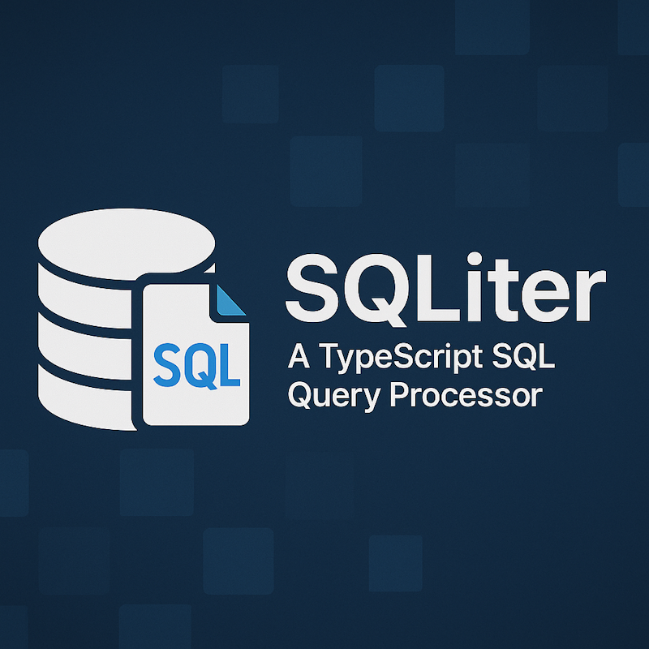

# Quereus - A TypeScript SQL Query Processor



**(Work In Progress - Undergoing Major Refactoring: Titan Project)**

Quereus is a lightweight, query processor, inspired by SQLite but specifically designed for efficient in-memory data processing with a strong emphasis on the **virtual table** interface. It aims to provide rich SQL query and constraint capabilities (joins, aggregates, subqueries, CTEs) over data sources exposed via the virtual table mechanism. Quereus has no persistent file storage, though one could be built as a virtual table module.

See [SQLite 3 Source](amalgamation/sqlite3.c) for C reference.
See [Titan Project Overview](docs/titan.md) for details on the new architecture.

## Project Goals

*   **Virtual Table Centric**: Provide a robust and flexible virtual table API as the primary means of interacting with data sources. All tables are virtual tables.
*   **In-Memory Focus**: Includes a comprehensive in-memory virtual table implementation (`MemoryTable`) with support for transactions and savepoints.
*   **TypeScript & Modern JS**: Leverage TypeScript's type system and modern JavaScript features and idioms.
*   **Async VTab Operations**: Virtual table data operations (reads/writes) are asynchronous. Cursors are implemented as async iterables.
*   **Cross-Platform**: Target diverse Javascript runtime environments, including Node.js, browser, and React Native.
*   **Minimal Dependencies**: Avoid heavy external dependencies where possible.
*   **SQL Compatibility**: Support a rich subset of SQL, particularly DML (select, insert, update, delete) features useful for querying and manipulating data across virtual tables.
*   **Key-Based Addressing**: All tables are addressed by their defined Primary Key. The concept of a separate, implicit `rowid` for addressing rows is not used (similar to SQLite's `WITHOUT ROWID` tables being the default and only mode).
*   **Third Manifesto Friendly**: Embraces some of the principles of the [Third Manifesto](https://www.dcs.warwick.ac.uk/~hugh/TTM/DTATRM.pdf), such as allowing for empty keys. Utilizes algebraic planning.

## Architecture Overview (Titan Project)

Quereus is transitioning to a new architecture ("Project Titan") based on partially immutable PlanNodes and an Instruction-based runtime. The old VDBE-based compiler is being phased out.

1.  **SQL Input**: The process starts with a SQL query string.
2.  **Parser (`src/parser`)**:
    *   **Lexer (`lexer.ts`)**: Tokenizes the raw SQL string.
    *   **Parser (`parser.ts`)**: Builds an Abstract Syntax Tree (AST).
3.  **Planner (`src/planner`)**:
    *   Traverses the AST to construct a tree of immutable `PlanNode` objects representing the logical query structure.
    *   Handles Common Table Expressions (CTEs) and Subqueries by converting them into relational `PlanNode`s.
    *   Resolves table and function references using the Schema Manager.
    *   Performs query planning, incorporating virtual table `xBestIndex` method and table schema statistics.
4.  **Runtime (`src/runtime`)**:
    *   **Emitters (`src/runtime/emitters.ts`, `src/runtime/emit/`)**: Translate `PlanNode`s into a graph of `Instruction` objects.
    *   **Scheduler (`src/runtime/scheduler.ts`)**: Manages the execution flow of the `Instruction` graph.
    *   **Instructions**: JavaScript functions that operate on `RuntimeValue`s (which can be `SqlValue` or `AsyncIterable<Row>`). Async parameters are awaited.
    *   Invokes virtual table methods (e.g., `xQuery` which returns `AsyncIterable<Row>`, `xUpdate`) to interact with data.
    *   Calls User-Defined Functions (UDFs) and aggregate functions.
    *   Handles transaction and savepoint control.
5.  **Virtual Tables (`src/vtab`)**:
    *   The core data interface. Modules implement `VirtualTableModule`.
    *   `MemoryTable` (`vtab/memory/table.ts`) is a key implementation using `digitree`.
6.  **Schema Management (`src/schema`)**: Manages schemas, tables, columns, functions.
7.  **User-Defined Functions (`src/func`)**: Support for custom JS functions in SQL.
8.  **Core API (`src/core`)**: `Database`, `Statement` classes.

## Source File Layout

The project is organized into the following main directories:

*   `src/common`: Foundational types, constants, and error classes.
*   `src/core`: High-level API classes (`Database`, `Statement`).
*   `src/parser`: SQL lexing, parsing, and AST definitions.
*   `src/planner`: **(New)** Building and optimizing `PlanNode` trees from AST.
*   `src/runtime`: **(New)** Emission, scheduling, and execution of runtime `Instruction`s.
*   `src/schema`: Management of database schemas.
*   `src/vtab`: Virtual table interface and implementations (including `memory`).
*   `src/func`: User-defined functions.
*   `src/util`: General utility functions.
*   `docs`: Project documentation.
*   `oldsrc`: **(Legacy)** Contains the previous VDBE-based compiler and runtime.

## Logging

Quereus uses the [`debug`](https://github.com/debug-js/debug) library for internal logging. This allows for fine-grained control over log output based on namespaces, which correspond to the different modules of the system (e.g., `planner`, `runtime`, `vtab:memory`).

To enable logging during development or troubleshooting, set the `DEBUG` environment variable. Examples:

```bash
# Enable all Quereus logs
DEBUG=quereus:*

# Enable all virtual table logs
DEBUG=quereus:vtab:*

# Enable VDBE runtime logs and any warnings/errors from other modules
DEBUG=quereus:runtime,quereus:*:warn,quereus:*:error

# Enable everything EXCEPT verbose runtime logs
DEBUG=*,-quereus:runtime
```

### Developer Usage

To add logging within a module:

1.  **Import the logger factory:**
    ```typescript
    import { createLogger } from '../common/logger.js'; // Adjust path as needed

    const log = createLogger('my-module:sub-feature');
    ```

2.  **Log messages:** Use the logger instance like `console.log`, utilizing format specifiers (`%s`, `%d`, `%j`, `%O`) for better performance and readability.
    ```typescript
    log('Processing item ID %d', itemId);
    log('Current state: %O', complexObject);
    ```

3.  **(Optional) Create specialized loggers for levels:** You can use `.extend()` for specific levels like warnings or errors, which allows finer control via the `DEBUG` variable.
    ```typescript
    const warnLog = log.extend('warn');
    const errorLog = log.extend('error');

    warnLog('Potential issue detected: %s', issueDescription);
    if (errorCondition) {
      errorLog('Operation failed: %O', errorObject);
      // It's often still good practice to throw an actual Error here
    }
    ```

## Documentation

* [Usage Guide](docs/usage.md): Detailed usage examples and API reference
* [SQL Reference Guide](docs/sql.md): Detailed SQL reference guide
* [Functions](docs/functions.md): Details on the built-in functions
* [Memory Tables](docs/memory-table.md): Implementation details of the built-in MemoryTable module
* [Date/Time Handling](docs/datetime.md): Details on date/time parsing, functions, and the Temporal API.
* [Runtime](docs/runtime.md): Details on the runtime and opcodes.
* [Error Handling](docs/error.md): Details on the error handling and status codes.
* [TODO List](docs/todo.md): Planned features and improvements
* [Project Titan Architecture](docs/titan.md): **(New Overview)**
* [Window Function Architecture](docs/window-functions.md): **(Note: This describes the old VDBE approach and will need to be re-evaluated for Titan)**

## Key Design Decisions

*   **Federated / VTab-Centric**: All tables are virtual tables.
*   **Async Core**: Core operations are asynchronous. Cursors are `AsyncIterable<Row>`.
*   **Key-Based Addressing**: Rows are identified by their defined Primary Key. No separate implicit `rowid`.
*   **JavaScript Types**: Uses standard JavaScript types (`number`, `string`, `bigint`, `boolean`, `Uint8Array`, `null`) internally.
*   **Object-Based API**: Uses classes (`Database`, `Statement`) to represent resources with lifecycles, rather than handles.
*   **Transient Schema**: Schema information is primarily in-memory; persistence is not a goal. Emission of schema SQL export is supported.

## Major variations from SQLite

*   Uses `CREATE TABLE ... USING module(...)` syntax.
*   `PRAGMA default_vtab_module` can be used.
*   Supports `ASC`/`DESC` qualifiers on PRIMARY KEY column definitions.
*   Async core execution.
*   **No Rowids / `WITHOUT ROWID` by Default**: All tables are addressed by their Primary Key, similar to SQLite's `WITHOUT ROWID` tables being the only mode. The `WITHOUT ROWID` clause is not used.
*   **Implicit Primary Key Behavior**: When no explicit PRIMARY KEY is defined, Quereus includes all columns in the primary key. This differs from SQLite which uses the first INTEGER column or an implicit rowid. This design choice ensures predictable behavior and avoids potential confusion with SQLite's implicit rules.
*   No plans for:
    *   Triggers
    *   Persistent file storage (can be a VTab module)

## Current Status

Quereus is **actively undergoing a major architectural refactoring (Project Titan)** to a new planner and instruction-based runtime. The previous VDBE-based compiler and runtime (`oldsrc/`) are being replaced.

**Features of the new Titan architecture (under development):**
*   Core `PlanNode` to `Instruction` architecture established.
*   Emitters for basic operations (scans, literals, parameters, simple binary ops, DML) are being implemented.
*   Basic SQL query execution for `SELECT`, `INSERT`, `UPDATE`, `DELETE` on single tables is being built.
*   See `docs/titan.md` for detailed status of the new architecture.

**Previously supported features (in the old VDBE system, to be ported or re-implemented in Titan):**
*   CTEs (recursive and non-recursive with materialization hints).
*   Subqueries (scalar, comparison, `IN`, `EXISTS`, correlated).
*   Joins (`INNER`, `LEFT`, `CROSS`).
*   Aggregation (`GROUP BY`, `HAVING`).
*   `ORDER BY`, `LIMIT`/`OFFSET`.
*   Transactions and Savepoints (on VTabs that support them, like `MemoryTable`).
*   `MemoryTable`, `JsonEach`, `JsonTree` VTabs.
*   Extensive built-in functions.
*   `PRAGMA`s.
*   `CREATE TABLE`/`DROP TABLE`/`CREATE INDEX`/`DROP INDEX`.
*   Row-level `CHECK` constraints.

**Limitations & Missing Features (for the new Titan architecture):**
*   Many SQL features are yet to be fully ported to the new planner/runtime (e.g., complex joins, full aggregation, window functions, advanced subqueries).
*   Query optimization is currently minimal in the new planner.
*   Constraint enforcement (beyond basic VTab interactions for DML) needs to be integrated into the new runtime.
*   Comprehensive testing for the Titan architecture is ongoing.

## Testing

The tests are located in `test/*.spec.ts` and are driven by Mocha via aegir.

```bash
yarn test
```

Quereus employs a multi-faceted testing strategy:

1.  **SQL Logic Tests (`test/logic/`)**:
    *   Inspired by SQLite's own testing methodology.
    *   Uses simple text files (`*.sqllogic`) containing SQL statements and their expected JSON results (using `→` marker) or expected error messages (using `-- error:` directive).
    *   Driven by a Mocha test runner (`test/logic.spec.ts`) that executes the SQL against a fresh `Database` instance for each file.
    *   **Configurable Diagnostics**: On unexpected failures, the test runner provides clean error messages by default with optional detailed diagnostics controlled by environment variables:
        *   `QUEREUS_TEST_SHOW_PLAN=true` - Include query plan in diagnostics
        *   `QUEREUS_TEST_SHOW_PROGRAM=true` - Include instruction program in diagnostics
        *   `QUEREUS_TEST_SHOW_STACK=true` - Include full stack trace in diagnostics
        *   `QUEREUS_TEST_SHOW_TRACE=true` - Include execution trace in diagnostics
    *   This helps pinpoint failures at the Parser, Planner, or Runtime layer while keeping output manageable.
    *   Covers core functionality: basic CRUD, expressions, joins, aggregates, subqueries, CTEs, transactions, VTab planning basics, built-ins, and common error paths.

2.  **Property-Based Tests (`test/property.spec.ts`)**:
    *   Uses the `fast-check` library to generate a wide range of inputs for specific, tricky areas.
    *   Focuses on verifying fundamental properties and invariants that should hold true across many different values.
    *   Currently includes tests for:
        *   **Collation Consistency**: Ensures `ORDER BY` results match the behavior of the `compareSqlValues` utility for `BINARY`, `NOCASE`, and `RTRIM` collations across various strings.
        *   **Numeric Affinity**: Verifies that comparisons (`=`, `<`) in SQL handle mixed types (numbers, strings, booleans, nulls) consistently with SQLite's affinity rules, using `compareSqlValues` as the reference.
        *   **JSON Roundtrip**: Confirms that arbitrary JSON values survive being processed by `json_quote()` and `json_extract('$')` without data loss or corruption.

3.  **Performance Sentinels (Planned)**:
    *   Micro-benchmarks for specific scenarios (e.g., bulk inserts, complex queries) to catch performance regressions.

4.  **CI Integration (Planned)**:
    *   Utilize GitHub Actions (or similar) to run test suites automatically, potentially with different configurations (quick checks, full runs, browser environment).

This layered approach aims for broad coverage via the logic tests while using property tests to explore edge cases in specific subsystems more thoroughly.

## Supported Built-in Functions

*   **Scalar:** `lower`, `upper`, `length`, `substr`/`substring`, `abs`, `round`, `coalesce`, `nullif`, `like`, `glob`, `typeof`
*   **Aggregate:** `count`, `sum`, `avg`, `min`, `max`, `group_concat`, `json_group_array`, `json_group_object`
*   **Date/Time:** `date`, `time`, `datetime`, `julianday`, `strftime` (supports common formats and modifiers)
*   **JSON:** `json_valid`, `json_type`, `json_extract`, `json_quote`, `json_array`, `json_object`, `json_insert`, `json_replace`, `json_set`, `json_remove`, `json_array_length`, `json_patch`

## Future Work

See the [TODO List](docs/todo.md) and [Project Titan](docs/titan.md) for a detailed breakdown.


