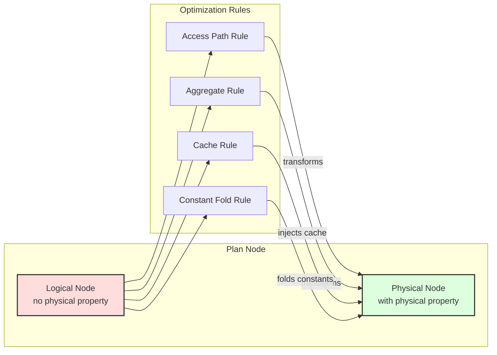

# Quereus Query Optimizer

The Quereus optimizer transforms logical query plans into efficient physical execution plans through a rule-based transformation system. This document provides a comprehensive reference for understanding and extending the optimizer.  This document reflects the current or future design of the system.  See TODO.md for descriptions of enhancements.

## Philosophy

The Quereus optimizer embodies several core principles that guide its design and implementation:

### Virtual Table Centric
The optimizer is built around the premise that all data access happens through virtual tables. This means optimization decisions must respect the capabilities and constraints exposed by each virtual table module through the `BestAccessPlan` API.

### Streaming First
Quereus prioritizes streaming execution over materialization. The optimizer favors transformations that preserve pipeline-able operations and only introduces blocking operations (sorts, materializations) when absolutely necessary for correctness or significant performance gains.

### Attribute-Based Identity
Column identity is tracked through stable attribute IDs rather than names or positions. This enables robust column reference resolution across arbitrary plan transformations without the fragility of name-based or position-based systems.

### Single Hierarchy, Dual Phase
Rather than maintaining separate logical and physical plan hierarchies, Quereus uses a single `PlanNode` tree that transitions from logical to physical through property annotation. This eliminates duplication while maintaining clear phase separation.

### Cost-Based with Heuristic Fallbacks
While the optimizer uses cost estimates to guide decisions, it provides sensible heuristic defaults when statistics are unavailable. This ensures reasonable plan quality even without detailed table statistics.

### Property based rules
Rather than tying rules to specific node types, as much as possible, the optimizer and its rules are tied to properties of the nodes, such as the physical properties, or the node's data type.  This reduces direct dependencies, making the system more robust and flexible.

## Architecture Overview

The Quereus optimizer operates as a transformation engine between the plan builder and runtime emitter:

```
┌─────────────┐     ┌──────────────┐     ┌─────────────┐     ┌──────────────┐
│   Parser    │ --> │   Builder    │ --> │  Optimizer  │ --> │   Emitter    │
│             │     │              │     │             │     │              │
│ SQL → AST   │     │ AST → Logic  │     │Logic → Phys │     │ Phys → Code  │
└─────────────┘     └──────────────┘     └─────────────┘     └──────────────┘
```

The optimizer uses a **multi-pass architecture** where different categories of transformations occur in separate tree traversals. Each pass can use either top-down or bottom-up traversal order depending on its requirements:



### Multi-Pass Optimization System

The optimizer executes transformations through a series of **optimization passes**, each with a specific purpose and traversal order:

#### Pass 0: Constant Folding (Bottom-up)
- **Purpose**: Pre-evaluate constant expressions before other optimizations
- **Traversal**: Bottom-up to evaluate from leaves to root
- **Implementation**: Custom execution using runtime expression evaluator
- **Result**: Simplified plan with literals replacing constant expressions

#### Pass 1: Structural Transformations (Top-down)
- **Purpose**: Restructure the plan tree for optimal execution boundaries
- **Key Rules**: `ruleGrowRetrieve`, `rulePredicatePushdown`, `ruleScalarCSE`
- **Traversal**: Top-down to see parent context for sliding operations
- **Result**: Operations pushed into virtual table boundaries where beneficial; duplicate scalar expressions eliminated

#### Pass 2: Physical Selection (Bottom-up)
- **Purpose**: Convert logical operators to physical implementations
- **Key Rules**: `ruleSelectAccessPath`, `ruleAggregatePhysical`
- **Traversal**: Bottom-up to select implementations based on child properties
- **Result**: Executable physical plan with concrete operators

#### Pass 3: Post-Optimization (Bottom-up)
- **Purpose**: Final cleanup, materialization decisions, and caching
- **Key Rules**: `ruleMaterializationAdvisory`, `ruleCteOptimization`, `ruleMutatingSubqueryCache`, `ruleInSubqueryCache`
- **Traversal**: Bottom-up for global analysis and cache injection
- **Result**: Optimized plan with caching and materialization points

#### Pass 4: Validation (Bottom-up)
- **Purpose**: Validate the correctness of the optimized plan
- **Implementation**: Structural and property validation checks
- **Result**: Verified executable plan or error if invalid

### Pass Framework (`src/planner/framework/pass.ts`)

The pass system provides a clean abstraction for multi-pass optimization:

```typescript
interface OptimizationPass {
  id: string;                          // Unique identifier
  name: string;                        // Human-readable name
  traversalOrder: TraversalOrder;      // 'top-down' or 'bottom-up'
  rules: RuleHandle[];                 // Rules belonging to this pass
  execute?: (plan, context) => plan;   // Optional custom execution
  order: number;                       // Execution order (lower first)
}
```

**Key Benefits**:
- **Separation of Concerns**: Each pass focuses on a specific optimization category
- **Proper Sequencing**: Structural transformations happen before physical selection
- **Flexible Traversal**: Each pass can choose its optimal traversal order
- **Clean Debugging**: Clear pass boundaries make optimization easier to understand
- **Depth safety**: Traversal enforces `tuning.maxOptimizationDepth` to prevent pathological recursion

### Core Components

**Pass Manager** (`src/planner/framework/pass.ts`)
- Coordinates execution of all optimization passes
- Manages rule registration per pass
- Implements both top-down and bottom-up traversal strategies
- Provides hooks for custom pass execution logic

**Rule Engine** (`src/planner/optimizer.ts`)
- Registers rules to appropriate passes based on their purpose
- Creates optimization context for rule execution
- Integrates with pass manager for multi-pass optimization
- Provides debugging and tracing infrastructure

**Physical Properties** (`src/planner/framework/physical-utils.ts`)
- Captures execution characteristics: ordering, uniqueness, cardinality, monotonic-on-attribute
- `monotonicOn` (per `MonotonicOnInfo` in `nodes/plan-node.ts`) is stronger than `ordering`: it identifies an attribute the relation is totally ordered on (with optional `strict` to assert no duplicates), and is meaningful only for total-order-preserving sources (vtab access plans that advertise it; sort nodes; merge join). Propagation rules live alongside each operator's `computePhysical`.
- `rangeBoundedOn` is a non-relational annotation set by `monotonic-range-access` on physical leaves whose access plan walks a `MonotonicOn(x)` path bounded by a recognized range predicate on `x`. See [Monotonic range-scan recognition](#monotonic-range-scan-recognition) below.
- Propagates properties through plan transformations
- Enables property-based optimization decisions

**Rule Framework** (`src/planner/framework/`)
- Standard rule signature: `(node, context) → node | null`
- Context provides access to database, statistics, and tuning parameters
- Rules are pure functions that return transformed nodes or null

**Generic Tree Rewriting** (`PlanNode.withChildren()`)
- Every plan node implements generic tree reconstruction
- Preserves attribute IDs during transformations
- Eliminates manual node-specific handling in optimizer core

## Design Decisions

### Immutable Plan Nodes
Plan nodes are never mutated after construction. All transformations create new nodes, ensuring:
- Clear debugging with before/after comparisons
- Safe concurrent access during optimization
- Predictable transformation behavior

### Attribute ID Preservation
The optimizer guarantees that attribute IDs remain stable across transformations:
```typescript
// ProjectNode preserves original attribute IDs
const newProjections = this.projections.map((proj, i) => ({
  node: newProjectionNodes[i] as ScalarPlanNode,
  alias: proj.alias,
  attributeId: proj.attributeId // ✅ Preserved from original
}));
```

### Two-Phase Transformation
1. **Logical Phase**: Builder creates plan nodes without physical properties
2. **Physical Phase**: Optimizer transforms and annotates with physical properties

This separation allows the builder to focus on semantic correctness while the optimizer handles execution strategy.

### Rule-Based Transformation
Optimization logic is organized into focused, composable rules:
- Each rule has a single responsibility
- Rules can be enabled/disabled independently  
- New optimizations can be added without modifying core code
- Rules are registered per node type for efficient dispatch

## Engineering Considerations

### Generic Tree Walking
The optimizer uses a generic tree walking mechanism via `withChildren()`:

```typescript
private optimizeChildren(node: PlanNode): PlanNode {
  const originalChildren = node.getChildren();
  const optimizedChildren = originalChildren.map(child => this.optimizeNode(child));
  
  const childrenChanged = optimizedChildren.some((child, i) => child !== originalChildren[i]);
  if (!childrenChanged) {
    return node;
  }
  
  return node.withChildren(optimizedChildren); // Attribute IDs preserved
}
```

This eliminates error-prone manual reconstruction and ensures consistent handling across all node types.

### Cost Model Integration
Cost estimation is centralized in `src/planner/cost/index.ts`:
- Consistent formulas across optimization rules
- Tunable parameters via `OptimizerTuning`
- Clear units (rows, cost units, bytes)

### Statistics Abstraction
The `StatsProvider` interface allows pluggable statistics sources:
```typescript
interface StatsProvider {
  tableRows(table: TableSchema): number | undefined;
  selectivity(table: TableSchema, pred: ScalarPlanNode): number | undefined;
  joinSelectivity?(left: TableSchema, right: TableSchema, cond: ScalarPlanNode): number | undefined;
  distinctValues?(table: TableSchema, columnName: string): number | undefined;
  indexSelectivity?(table: TableSchema, indexName: string, pred: ScalarPlanNode): number | undefined;
}
```

The default provider is `CatalogStatsProvider`, which reads real statistics from `TableSchema.statistics` (populated by `ANALYZE` or `VirtualTable.getStatistics()`) and falls back to `NaiveStatsProvider` heuristics when unavailable. When catalog statistics include equi-height histograms, range and equality selectivity estimates use histogram interpolation rather than uniform assumptions.

### Physical Properties System

Physical properties are automatically computed and cached for each plan node using a bottom-up inheritance model:

**Default Properties**
```typescript
const DEFAULT_PHYSICAL: PhysicalProperties = {
  deterministic: true,    // Pure - same inputs produce same outputs
  readonly: true,         // No side effects
  idempotent: true,       // Safe to call multiple times
  constant: false,        // Not a constant value
};
```

**Inheritance Model**
```typescript
// Physical properties are lazily computed and cached
get physical(): PhysicalProperties {
  if (!this._physical) {
    const childrenPhysical = this.getChildren().map(child => child.physical);

    // Get node-specific overrides
    const propsOverride = this.computePhysical?.(childrenPhysical);

    // Derive defaults from children if any, else use DEFAULT_PHYSICAL
    const defaults = childrenPhysical.length
      ? {
        deterministic: childrenPhysical.every(child => child.deterministic),
        idempotent: childrenPhysical.every(child => child.idempotent),
        readonly: childrenPhysical.every(child => child.readonly),
        // constant is not inherited; only leaf nodes explicitly set it
      }
      : DEFAULT_PHYSICAL;

    this._physical = { ...defaults, ...propsOverride };
  }
  return this._physical;
}
```

**Key Principles:**
- Leaf nodes get `DEFAULT_PHYSICAL` properties
- Parent nodes inherit the most restrictive properties from children
- Nodes can override specific properties via `computePhysical()`; `constant` is only set explicitly by nodes that can provide `getValue()`
- Properties are computed once and cached

**Property Computation Example**
```typescript
// SortNode only overrides specific properties
computePhysical(): Partial<PhysicalProperties> {
  return {
    ordering: extractOrderingFromSortKeys(this.sortKeys),
    estimatedRows: this.source.physical.estimatedRows,
    // deterministic and readonly are inherited from source
  };
}
```

### Scalar Expression Properties (per-attribute)

Distinct from `physical` (relational, cached on the node), `ScalarPlanNode` exposes three **per-attribute** property methods on `PlanNode`:

```typescript
isInjectiveIn(inputAttrId: number): InjectivityResult;
monotonicityIn(inputAttrId: number): MonotonicityResult;  // Monotonicity = 'increasing' | 'decreasing' | 'constant' | 'non_monotone' | 'unknown'
rangeRewriteIn(inputAttrId: number, constant: SqlValue): RangeRewrite | undefined;
```

The base class returns conservative defaults (`{ injective: false }` / `{ monotonicity: 'unknown' }` / `undefined`); concrete scalar nodes override only what they can prove. Composite nodes (`UnaryOpNode`, `BinaryOpNode`, `ScalarFunctionCallNode`) recurse into children — they don't switch on `nodeType`. Helper lattices `addMonotonicity` and `negateMonotonicity` (in `nodes/plan-node.ts`) compose the operator rules.

`ScalarFunctionCallNode` consults per-function traits on `FunctionSchema`:
- `injectiveOnArgs?: readonly number[]` — arg indices on which the function is injective when other args are constants.
- `monotoneOnArgs?: { [argIndex]: 'increasing' | 'decreasing' }` — direction-of-monotonicity per arg.
- `rangeRewriteOnArg?: { [argIndex]: { kind: string } }` — names a bucketing kind; the actual boundary computation lives on the operand's `LogicalType.bucketBounds(kind, value)`.

The function-call traits compose with the operand's own `monotonicityIn` / `isInjectiveIn`, so `f(g(x))` is treated correctly when both layers are annotated. `rangeRewriteIn` is intentionally tighter: it only rewrites the `f(x) op c` case, requiring the operand to be a bare `ColumnReferenceNode` for the queried attribute (anything else would conflate value spaces).

Consumers (key propagation through non-trivial projections, sargable predicate rewrites for `date(ts) = D`, etc.) will arrive in separate tickets.

### TVF Property Declarations

Table-valued functions can advertise relational and physical characteristics through an optional `relationalAdvertisement` field on `TableValuedFunctionSchema`. Without it, a TVF's logical `returnType.keys` / `returnType.isSet` are exposed but `physical` defaults are conservative (no `uniqueKeys`, no `ordering`, no `monotonicOn`, default `estimatedRows`). With an advertisement, `TableFunctionCallNode.computePhysical` consumes it on the standard physical-property path so downstream rules (FD propagation, DISTINCT elimination, sort/monotonic-window rules, cardinality estimation) see the same information they get from a real vtab.

**Advertisement surface** — each field is either a static value or a `TVFAdvertiseFn<T>` that receives the call's operands and the schema and may return `undefined` to decline:

| Field | Type | Notes |
|---|---|---|
| `isSet` | `boolean` | Overrides `returnType.isSet` when present. |
| `keys` | `ReadonlyArray<ReadonlyArray<ColRef>>` | Output-column unique keys; populates `physical.uniqueKeys` and `getType().keys`. |
| `fds` | `ReadonlyArray<FunctionalDependency>` | Additional (non-key) FDs over output columns. |
| `equivClasses` | `ReadonlyArray<ReadonlyArray<number>>` | Equivalence classes; each class must have ≥ 2 members. |
| `ordering` | `ReadonlyArray<{column, desc}>` | Output ordering. |
| `monotonicOnColumns` | `ReadonlyArray<{column, direction, strict?}>` | Column-keyed monotonicity; preferred over `monotonicOn` because the node mints attribute IDs per call — the node translates `column → attrId` when assembling physical props. |
| `monotonicOn` | `ReadonlyArray<MonotonicOnInfo>` | Direct form for advanced uses where the author already has the attrId. |
| `constantBindings` | `ReadonlyArray<ConstantBinding>` | Columns pinned to a single value over the call. |
| `estimatedRows` | `number` | Row-count estimate; the `TableFunctionCallNode.estimatedRows` getter consults this before falling back to the default. |
| `accessCapabilities` | `PhysicalProperties['accessCapabilities']` | `ordinalSeek` / `asofRight`. |
| `deterministic`, `readonly`, `idempotent` | `boolean` | Overrides the FunctionFlags-derived defaults. |

**Literal operand inspection** — `evaluateLiteralOperand(operand)` (from `schema/function.js`) returns `operand.expression.value` when the operand is a literal and `undefined` otherwise. Use it in a `TVFAdvertiseFn` closure to declare parameter-dependent values:

```typescript
estimatedRows: (operands) => {
  const start = evaluateLiteralOperand(operands[0]);
  const end = evaluateLiteralOperand(operands[1]);
  if (typeof start === 'number' && typeof end === 'number' && end >= start) {
    return end - start + 1;
  }
  return undefined;  // Decline when bounds are non-literal.
},
```

**Validation** — every advertised field is shape-checked against the call's column count and attribute set before it lands in `physical`. Bad advertisements (out-of-range column indices, empty FD dependents, equivalence classes of size < 1, duplicate ordering columns, etc.) are dropped silently with a single warning on the `planner:tvf` log channel — they never break planning. A `TVFAdvertiseFn` closure that throws is treated the same way. This guarantees a buggy third-party advertisement degrades to "no advertisement" instead of poisoning the optimizer.

**Built-in annotations** — the following TVFs ship with relational advertisements:

| TVF | Advertisement |
|---|---|
| `generate_series(start, end)` | `isSet`, `keys=[[value]]`, `ordering=[{value, asc}]`, `monotonicOnColumns=[{value, asc, strict}]`, `estimatedRows` (when bounds are literal). |
| `json_each(json[, path])` | `isSet`, `keys=[[id]]`. |
| `json_tree(json[, path])` | `isSet`, `keys=[[id]]`. |
| `query_plan(sql)` | `isSet`, `keys=[[id]]`. |
| `table_info(table)` | `isSet`, `keys=[[cid]]`. |
| `index_info(table)` | `isSet`, `keys=[[index_name, seq]]`. |
| `foreign_key_info(table)` | `isSet`, `keys=[[id, seq]]`. |
| `unique_constraint_info(table)` | `isSet`, `keys=[[id, seq]]`. |
| `check_constraint_info(table)` | `isSet`, `keys=[[id]]`. |
| `assertion_info()` | `isSet`, `keys=[[name]]`. |
| `function_info()` | `isSet`, `keys=[[name, num_args]]`. |

Non-deterministic or trace-only TVFs (`execution_trace`, `row_trace`, `stack_trace`, `scheduler_program`, `schema_size`, `explain_assertion`, `schema`) skip advertisement.

### Constant Folding Subsystem

Constant folding is an elaborate optimization that evaluates constant expressions at plan time rather than runtime. The system uses a three-phase algorithm with sophisticated dependency tracking.

See [Constant Folding System](optimizer-const.md) for details.

**Core Concepts**

The `constant` physical property has strict requirements:
- A node is `constant: true` **only if** it implements the `ConstantNode` interface with `getValue()`
- This means the node can statically provide its value at plan time
- Examples: `LiteralNode`, materialized relation nodes

```typescript
interface ConstantNode extends PlanNode {
  getValue(): OutputValue;  // Must return the constant value
}
```

**Three-Phase Algorithm**

Rather than stopping propagation when a column reference is found, the optimizer notes the reference and continues to see if the expressions remains otherwise constant at the point where said column is resolved.  This allows even complex queries to be fully folded, if they truly are constant.

1. **Bottom-up Classification**: Assigns `ConstInfo` to every node
   - `const`: Nodes with `physical.constant === true` that implement `getValue()`
   - `dep`: Nodes depending on specific attribute IDs (e.g., column references)
   - `non-const`: Non-functional nodes or those with non-const children

2. **Top-down Border Detection**: Identifies foldable nodes
   - Const nodes are always border nodes
   - Dep nodes become border nodes when their dependencies are resolved
   - Tracks which attributes are known constants in each scope

3. **Replacement Phase**: Replaces border nodes with literals
   - Scalar expressions → `LiteralNode`
   - Relational expressions → Materialized relation nodes (future)

**Dependency Resolution**

The system tracks constant attribute propagation through the plan:
```typescript
// ProjectNode produces constant attribute 42 if its expression is const
if (exprInfo?.kind === 'const') {
  updatedKnownAttrs.add(42);  // Attribute 42 is now a known constant
}

// Later, ColumnReference to attribute 42 can be folded
if (nodeInfo?.kind === 'dep' && isSubsetOf(nodeInfo.deps, knownConstAttrs)) {
  // This dep node can be folded because its dependencies are resolved
}
```

**Important Constraints**

- **Never set `constant: true` without implementing `getValue()`** - This will cause runtime errors
- **Constant folding respects functional properties** - Only nodes with `deterministic && readonly` are considered
- **The optimizer uses runtime evaluation** - Complex expressions are evaluated using the actual runtime, ensuring correctness

**Example: Constant Propagation**
```sql
-- Original query
SELECT x + 1 AS y FROM t WHERE y > 5;

-- After constant folding with known x = 10
SELECT 11 AS y FROM t WHERE 11 > 5;  -- Expression folded
SELECT 11 AS y FROM t WHERE true;    -- Predicate folded
```

## Component Reference

### Plan Node Hierarchy

All plan nodes extend the base `PlanNode` class and implement category-specific interfaces:

**Base Classes**
- `PlanNode`: Abstract base with cost, scope, and transformation methods
- `RelationalNode`: Nodes producing row streams (implement `getAttributes()`)
- `ScalarNode`: Nodes producing scalar values
- `VoidNode`: Nodes with side effects (DDL, DML)

**Key Methods**
- `getChildren()`: Returns all child nodes in consistent order
- `withChildren(newChildren)`: Creates new instance with updated children
- `computePhysical()`: Optionally overrides specific physical properties
- `getLogicalProperties()`: Returns logical plan information

### Optimization Rules

Rules are organized by optimization family in `src/planner/rules/`:

**Access Path Selection** (`access/`)
- `ruleSelectAccessPath`: Chooses between sequential scan, index scan, and index seek for both primary and secondary indexes

**Aggregation** (`aggregate/`)
- `ruleAggregatePhysical`: Cost-based selection between `StreamAggregateNode` and `HashAggregateNode`. Scalar aggregates (no GROUP BY) always use stream. Already-sorted input always uses stream (preserves ordering). Unsorted input compares sort+stream cost vs hash cost and picks the cheaper option.

**Caching** (`cache/`)
- `ruleCteOptimization`: Adds caching to frequently-accessed CTEs
- `ruleInSubqueryCache`: Wraps uncorrelated, deterministic IN-subquery sources in CacheNode
- `ruleMaterializationAdvisory`: Global analysis for cache injection
- `ruleMutatingSubqueryCache`: Ensures mutating subqueries execute once
- `ruleScalarCSE`: Scalar common subexpression elimination. Detects duplicate deterministic scalar expressions across a ProjectNode and its child chain (Filter, Sort), injects a lower ProjectNode that computes each deduplicated expression once, and replaces duplicates with column references. Skips bare column references, literals, and non-deterministic expressions. Runs in the Structural pass at priority 22.

**Retrieve** (`retrieve/`)
- `ruleProjectionPruning`: Prunes unused inner projections in Project-on-Project patterns (common after view expansion). Collects attribute IDs referenced by the outer project's scalar expressions, then filters the inner project to only those projections whose output attributes are referenced. Skips when all inner projections are used or pruning would yield zero projections. Runs in the Structural pass at priority 19 (between distinct-elimination at 18 and predicate-pushdown at 20).

**Join** (`join/`)
- `ruleJoinPhysicalSelection`: Selects hash join or merge join over nested loop for equi-joins when cheaper. Three-way cost comparison (nested-loop vs hash vs merge). Supports INNER, LEFT, SEMI, and ANTI join types. Merge-join recognition here is positional on `physical.ordering`.
- `ruleMonotonicMergeJoin`: Recognises merge-join opportunities whenever both sides advertise `MonotonicOn` on the equi-pair attributes — strictly broader than ordering-based recognition. Picks up cases the ordering-based rule misses (notably parent joins on a child `MergeJoin`'s right-side equi-pair attribute, where the child's `physical.ordering` reflects only the left side but `monotonicOn` covers both). Single driving equi-pair in v1; remaining equi-pairs become residual conjuncts. Defers to `ruleJoinPhysicalSelection` whenever ordering already covers all pairs (so multi-key merge joins keep full unique-key propagation). Runs at priority 4 in PostOptimization, ahead of `ruleJoinPhysicalSelection` (priority 5).
- `ruleLateralTop1Asof`: Recognizes the lateral-top-1 idiom and rewrites it to a streaming `AsofScanNode` (see "Streaming asof scan" below).

**Predicate** (`predicate/`)
- `rulePredicatePushdown`: Pushes filter predicates down across safe commuting nodes (Sort, Distinct, Alias, eligible Project) and into RetrieveNode boundaries where the virtual table module supports them, reducing rows processed upstream.
- `ruleFilterMerge`: Merges adjacent Filter nodes into a single Filter with an AND-combined predicate. Iteratively absorbs entire chains of adjacent filters in one visit. Runs in the Structural pass at priority 21 (after predicate pushdown at 20).

**Subquery** (`subquery/`)
- `ruleSubqueryDecorrelation`: Transforms correlated EXISTS/IN subqueries in WHERE-clause filters into semi/anti joins, enabling hash join selection and eliminating per-row re-execution. Handles: correlated EXISTS → semi join, NOT EXISTS → anti join, correlated IN → semi join. NOT IN is deferred (NULL semantics complexity). Runs in the Structural pass at priority 25 (after predicate pushdown).

**Constant Folding** (pass)
- Constant folding pass: Evaluates constant expressions at plan time

### Virtual Table Integration

The optimizer integrates with virtual tables through the `BestAccessPlan` API:

```typescript
interface BestAccessPlanRequest {
  columns: readonly ColumnMeta[];
  filters: readonly PredicateConstraint[];
  requiredOrdering?: OrderingSpec;
  limit?: number | null;
  estimatedRows?: number;
}

interface BestAccessPlanResult {
  handledFilters: boolean[];
  cost: number;
  rows: number | undefined;
  providesOrdering?: OrderingSpec;
  uniqueRows?: boolean;

  // Optional monotonic-storage advertisements. Lifted onto the physical leaf's
  // `physical.monotonicOn` / `physical.accessCapabilities`; not propagated by
  // single-input pass-through nodes (Filter, LimitOffset, Alias).
  monotonicOn?: { columnIndex: number; direction: 'asc' | 'desc'; strict: boolean };
  supportsOrdinalSeek?: boolean; // implies monotonicOn
  supportsAsofRight?: boolean;   // implies monotonicOn
}
```

Virtual tables communicate their capabilities, allowing the optimizer to:
- Push predicates to the data source
- Utilize indexes for efficient access
- Preserve beneficial orderings
- Estimate result cardinalities

### Debugging and Tracing

The optimizer provides comprehensive debugging support:

**Debug Namespaces**
- `quereus:optimizer`: General optimizer operations
- `quereus:optimizer:rule:*`: Individual rule execution
- `quereus:optimizer:properties`: Physical property computation

**Trace Hooks**
```typescript
interface TraceHook {
  onRuleStart?(rule: RuleHandle, node: PlanNode): void;
  onRuleEnd?(rule: RuleHandle, before: PlanNode, after: PlanNode | undefined): void;
}
```

**Plan Visualization and Testing**
The PlanViz tool (`packages/tools/planviz`) provides visual plan inspection:
```bash
quereus-planviz query.sql --format tree
quereus-planviz query.sql --format mermaid --phase physical
```

Testing optimizer effects is easy using the `query_plan()` built-in:
```sql
-- Example: ensure FILTER was pushed into Retrieve (0 remaining above)
SELECT COUNT(*) AS filters
FROM query_plan('SELECT id FROM t WHERE id = 1')
WHERE op = 'FILTER';
```

## Extending the Optimizer

### Adding a New Optimization Rule

1. **Create Rule File** in appropriate subdirectory:
```typescript
// src/planner/rules/category/rule-name.ts
export function ruleMyOptimization(
  node: PlanNode,
  context: OptimizerContext
): PlanNode | null {
  // Check applicability
  if (!isApplicable(node)) {
    return null;
  }
  
  // Transform node
  const transformed = performTransformation(node);
  
  // Preserve attribute IDs!
  return transformed;
}
```

2. **Register Rule** in optimizer:
```typescript
// src/planner/optimizer.ts
this.registerRule('MyRule', PlanNodeType.Target, ruleMyOptimization);
```

3. **Add Tests** with golden plans:
```sql
-- test/plan/my-optimization/test.sql
SELECT * FROM users WHERE active = true;
```

### Best Practices

**Rule Development**
- Keep rules focused on a single transformation
- Return `null` for non-applicable cases
- Never mutate input nodes
- Always preserve attribute IDs
- **Use characteristics-based patterns**: Prefer `CapabilityDetectors` over `instanceof` checks for robust, extensible rules
- Include comprehensive tests

**Property Computation**
- Implement `computePhysical()` to override physical properties for new node types
- Use automatic inheritance of properties from children when appropriate
- Document any property assumptions

**Cost Estimation**
- Use centralized cost functions
- Provide reasonable defaults
- Document cost model assumptions

## Common Patterns

### Predicate Analysis and Pushdown

The optimizer includes sophisticated predicate analysis for pushdown optimization:

```typescript
import { extractConstraints, createTableInfoFromNode } from '../analysis/constraint-extractor.js';

// Extract constraints from filter predicates for pushdown
const tableInfo = createTableInfoFromNode(tableNode, 'main.users');
const result = extractConstraints(filterPredicate, [tableInfo]);

// Use constraints for virtual table pushdown
const tableConstraints = result.constraintsByTable.get('main.users');
if (tableConstraints) {
  // Push constraints to virtual table via BestAccessPlan API
  const pushedTable = new TableReferenceWithConstraintsNode(
    scope, tableSchema, vtabModule, tableConstraints
  );
}
```

**Predicate Pushdown Implementation:**
- **Normalization**: Pushes NOT, flattens AND/OR (no CNF/DNF), inverts comparisons; collapses small OR-of-equalities to `IN`; preserves BETWEEN (NOT BETWEEN remains residual).
- **Constraint Extraction**: Analyzes equality/range (`=`, `>`, `>=`, `<`, `<=`), `IS NULL`/`IS NOT NULL`, `BETWEEN` (as `>=`/`<=`), and `IN` value lists. Supports dynamic bindings: parameters and correlated references are captured alongside literal values.
- **Supported-only placement**: Only the portion of a predicate that is known to be supported by the target module/index is pushed into the `Retrieve` pipeline. Any residual (unsupported) part remains above the `Retrieve`. This guarantees the `Retrieve` pipeline exclusively contains supported operations.
- **Module Validation via supports()**: For query-based modules, a predicate (or entire filter node) is only pushed below the `RetrieveNode` when `supports()` accepts the resulting pipeline. Acceptance typically implies significantly lower cost and should be preferred over mere proximity to the data source.
- **Index-style Fallback**: When a module does not implement `supports()`, push-down uses `getBestAccessPlan()` for constraints translation; benefits may come from filter handling, ordering, and limit pushdown.
- **Filter Elimination**: Removes Filter nodes when all predicates are successfully handled by the module/index.
- **Multi-table Support**: Modules may accept complex subtrees (including joins) in a single `supports()` call when multiple relations belong to the same module.

### Property Propagation
```typescript
computePhysical(): Partial<PhysicalProperties> {
  return {
    estimatedRows: this.source.estimatedRows,
    uniqueKeys: this.source.getType().keys.map(key => key.map(colRef => colRef.index)),
    ordering: this.providesOrdering
  };
}
```

### Cache Injection
```typescript
if (shouldCache(node, context)) {
  return new CacheNode(
    node.scope,
    node,
    'memory',
    calculateThreshold(node.physical.estimatedRows)
  );
}
```

## Performance Considerations

### Rule Ordering
- Rules execute in registration order
- Place cheap checks before expensive transformations
- Consider rule dependencies when ordering

### Property Caching
- Physical properties are computed once and cached
- Avoid redundant property calculations
- Use lazy evaluation where appropriate

### Memory Usage
- Plan trees can be large for complex queries
- Avoid keeping references to old plan nodes
- Clean up temporary data structures

## Known Issues

**Current Limitations**
- **OR predicate extraction**: The constraint extractor handles OR-of-equality disjunctions (collapsed to IN for index multi-seek) and OR-of-range disjunctions on the same indexed column (collapsed to OR_RANGE for multi-range index seek). OR disjunctions across different indexes (`tickets/plan/2-or-to-union-rewriting.md`) remain as residual filters.
- **Constant Folding**: Both scalar and relational constant folding are implemented. Constant relational subtrees (e.g., all-literal VALUES, constant subqueries) are replaced with `TableLiteralNode` via deferred materialization. See `docs/optimizer-const.md`.
- **Access Path Selection**: Supports primary and secondary index seek/range via module-provided `indexName`/`seekColumnIndexes`. Prefix-equality + trailing-range on composite indexes is not yet supported (`tickets/plan/2-composite-index-advanced-seeks.md`).

## Streaming asof scan

The "asof join" — for each left row, a single right row whose key relates to
the left's key by the asof predicate, optionally per partition — is a recurring
shape in time-series and event-stream queries. Two symmetric forms are
recognized:

- **Latest-le** (`direction = 'desc'`): largest right.K ≤ left.K. Predicate
  `q.K <= t.K` (or strict `<`), sort `order by q.K desc limit 1`.
- **Earliest-ge** (`direction = 'asc'`): smallest right.K ≥ left.K. Predicate
  `q.K >= t.K` (or strict `>`), sort `order by q.K asc limit 1`.

Standard SQL writes both as a lateral-top-1 subquery:

```sql
-- Latest-le (desc):
select t.*, q.bid, q.ask
from (select * from trades order by ts) t
left join lateral (
  select bid, ask from quotes q
  where q.symbol = t.symbol and q.ts <= t.ts
  order by q.ts desc limit 1
) q on true;

-- Earliest-ge (asc):
select t.*, q.bid
from (select * from trades order by ts) t
left join lateral (
  select bid from quotes q
  where q.symbol = t.symbol and q.ts >= t.ts
  order by q.ts asc limit 1
) q on true;
```

Without specialization this executes as a per-left-row re-evaluation of the
lateral subquery — `O(L · log R)` at best. The `ruleLateralTop1Asof` rule
recognizes the pattern and rewrites the JoinNode to an `AsofScanNode`, which
runs in `O(L + R)`.

The node carries a `strategy` discriminator picked up by
`rule-asof-strategy-select` after the children's physical properties are
finalized:

- **`'hash'`** (default): bucket the right by partition key into
  `Map<string, Row[]>`; stream the left with per-bucket cursors. Memory `O(R)`,
  latency = first emit after R fully arrives. The right's monotonic
  matchAttr advertisement is the only ordering required.
- **`'merge'`**: co-stream both inputs in lockstep when both already arrive in
  `[partition cols..., matchAttr]` order. Memory `O(1)` (one in-flight
  partition's saved match), emits as left rows arrive.

**Required pattern** (peeled in any nesting order; AliasNode is transparent):

```
JoinNode (joinType ∈ {inner, left, cross}, condition absent or trivially true)
  left:  Left
  right: ProjectNode? | LimitOffsetNode(LIMIT 1, no OFFSET) | SortNode (single column key)
            └─ FilterNode (ANDed: q.K op left.K  AND  q.P_i = left.P_i ...)
                  └─ ...some pipeline... TableReference
```

`op` is `<=`/`<` (latest-le) or `>=`/`>` (earliest-ge). The lateral-side
projection must be trivial column references (so the rule can preserve
attribute IDs). The Sort must be a single column reference; its direction must
agree with the predicate (`desc` ↔ `<=`/`<`, `asc` ↔ `>=`/`>`).

**Required vtab capabilities**: the underlying right table's `getBestAccessPlan`
must advertise `monotonicOn(K)` and `supportsAsofRight: true` for an ordered
scan on the asof match column. The `memory` module advertises this for the
leading column of the primary key.

**Required left ordering**: the left input must expose
`physical.monotonicOn(matchAttr)` — typically by wrapping the left in
`ORDER BY matchAttr` (or by relying on a PK that orders by the match column).
Without this, the per-bucket cursor would regress and produce wrong rows for
out-of-order left input. When the precondition is unmet the rule does not fire
and the existing nested-loop lateral path executes unchanged.

**Bail conditions**: the rule does not fire when

- the right access plan lacks `monotonicOn(K)` or `supportsAsofRight`,
- the lateral has multiple inequalities on the right key,
- the lateral's projection contains a non-trivial expression,
- `LIMIT n` for `n ≠ 1` or `OFFSET ≠ 0`,
- the sort is on a computed expression (not a trivial column reference),
- the sort direction disagrees with the predicate (e.g. `q.K <= t.K` with `order by q.K asc`),
- the left is not monotonic on the match attribute.

The rule runs in the Structural pass at priority 5 — before
`predicate-pushdown` (priority 20) — so the lateral's `FilterNode` carrying
the asof predicate is intact when matching.

### Strategy selection (hash → merge)

`rule-asof-strategy-select` runs in the PostOptimization pass at priority 11,
after `monotonic-range-access` has finalized the leaves' `physical.ordering` /
`monotonicOn` advertisements. It is a predicate-driven rewrite (no cost-side
search) that promotes `AsofScanNode.strategy` from `'hash'` to `'merge'` when:

- Both children's `physical.ordering` carries a leading
  `[partition cols..., matchAttr]` prefix. Partition columns may appear in any
  permutation, but the *positions* on left and right must pair via the
  `partitionAttrs` equi-pairs, with matching directions on each side.
- The trailing match-attr ordering is **ASC** on both sides. The merge emitter
  walks both inputs forward — `direction='desc'` accumulates the latest
  qualifier seen, `direction='asc'` returns the first qualifier — and that
  forward walk requires ascending match-attr sort regardless of asof
  direction.
- The right's estimated row count meets `tuning.asof.mergeRowThreshold`
  (default `10000`). Below the threshold, hash buffering's constant factors
  beat merge-state bookkeeping.

Bails (and the node stays on `'hash'`) on any failure. Disable via
`tuning.disabledRules` containing `'asof-strategy-select'`. Force-enable for
testing by setting `tuning.asof.mergeRowThreshold` to `0`.

The merge variant assumes the children's iterator already emits in the
required order; it does not synthesize the ordering. The current
`ruleLateralTop1Asof` precondition (`physical.monotonicOn(left.matchAttr)`)
typically requires the user to wrap the left in `ORDER BY matchAttr` — which
provides global match-attr monotonicity but no partition prefix. The
unpartitioned (`partitionAttrs.length === 0`) case is the natural fit today;
partitioned merge requires a left input with `[partition..., matchAttr]`
ordering, which is not yet recognized as "monotonic within partition" by the
recognition rule. That extension is a follow-up.

## Monotonic LIMIT/OFFSET pushdown

Paginating into the middle of a sorted result — `select … from t order by x limit n offset k` — is a common shape. Without specialization the runtime sorts/buffers `k + n` rows and discards `k` of them. When the access path advertises both `monotonicOn(x)` and `supportsOrdinalSeek`, the `monotonic-limit-pushdown` rule replaces the `LimitOffset[/Sort]/leaf` subtree with an `OrdinalSliceNode` that stamps `offset`/`limit` onto the leaf's `FilterInfo` so the vtab seeks directly to the kth row in `O(log N)` and emits at most `n` rows.

**Required pattern** (peeled top-down from `LimitOffsetNode`):

```
LimitOffsetNode
  └─ SortNode?           (single trivial column ref matching leaf monotonicOn)
        └─ (ProjectNode | AliasNode)*   (only trivial column-reference projections)
              └─ IndexScan / IndexSeek / SeqScan
                    (advertises monotonicOn AND accessCapabilities.ordinalSeek)
```

`OrdinalSliceNode` slots in directly above the leaf, preserving the original `Project`/`Alias` chain above it. The `Sort` is dropped — the slice's source already emits in the requested order, and re-sorting would be wasted work.

**Required vtab capabilities**: the leaf's access plan must advertise both `monotonicOn` and `supportsOrdinalSeek`. The vtab's `query()` implementation must honor `FilterInfo.offset` (positioning its iterator at the kth monotonic row) and `FilterInfo.limit` (capping output). Modules that advertise `supportsOrdinalSeek` but ignore the directives degrade silently to a streaming `LIMIT` (the slice still enforces the row cap as a guard above the leaf).

**Bail conditions**: the rule does not fire when

- the leaf lacks `accessCapabilities.ordinalSeek` or `monotonicOn`,
- a `Sort` sits between `LimitOffset` and the leaf with a different attribute, direction, or multiple keys,
- a non-trivial intermediate node (`Filter`, `Distinct`, `Aggregate`, `Project` with computed expressions, etc.) sits between `LimitOffset` and the leaf — the offset arithmetic only holds when the chain preserves row count and order,
- both `LIMIT` and `OFFSET` are absent (degenerate node),
- `ORDER BY` references multiple columns.

When the precondition is unmet the rule does not fire and the existing `LimitOffsetNode` path executes unchanged. The `memory` module currently does **not** advertise `supportsOrdinalSeek` (its layered store does not cheaply support ordinal seek across overlay layers); custom modules with native ordinal indexing — IndexedDB-backed stores, sorted external datasets — can opt in.

The rule runs in the PostOptimization pass at priority 8 (after `join-physical-selection`, before `mutating-subquery-cache`) — late enough that `select-access-path` has produced the physical leaf with its capabilities, early enough to interact with downstream cache and materialization rules.

The rule id `monotonic-limit-pushdown` can be disabled via `tuning.disabledRules`.

## Monotonic range-scan recognition

Range predicates that bound a `MonotonicOn` access column (`WHERE id BETWEEN 2 AND 5`, `WHERE id >= 2 AND id < 8`, `WHERE id > 4`, etc.) are already lowered to a range index seek by `rule-select-access-path`, which lifts the underlying access plan's `monotonicOn` advertisement onto the physical leaf. The `monotonic-range-access` rule sits on top of that plumbing and adds two things:

1. **Symbolic annotation (`rangeBoundedOn`)** — when the leaf advertises `monotonicOn(x)` and its `FilterInfo.constraints` carries a handled range/equality on `x`, the rule sets `physical.rangeBoundedOn` on the leaf so EXPLAIN and downstream rules can read off the symbolic bound:

	```jsonc
	"rangeBoundedOn": {
		"attrId": 17,
		"lower": { "op": ">=", "valueLiteral": 2 },
		"upper": { "op": "<=", "valueLiteral": 5 }
	}
	```

	`valueLiteral` is populated when the bound is a literal; for parameter / correlated bounds it is omitted (the bound is still recognized; only the literal display is). Half-open ranges omit `lower` or `upper`. The annotation is a pure label — it does not change the row stream.

2. **Defensive `monotonicOn` drop** — if a `FilterNode` sits directly above a leaf that advertises `monotonicOn(x)` and the Filter's predicate carries a range/equality on `x`, the vtab returned `handledFilters[i] = false` for the bound. The row stream emerging from the *Filter* is no longer monotonic over the WHERE-restricted set, so the rule drops `monotonicOn` (and the implied `accessCapabilities`) from the leaf via a `suppressMonotonic` flag on the leaf. In well-behaved modules this case never fires; the escalation is purely defensive against a misbehaving vtab.

### Recognition patterns

| SQL shape | Bound translation |
| --- | --- |
| `x BETWEEN a AND b` | `>= a` and `<= b` |
| `x >= a AND x <= b`, `x >= a AND x < b`, `x > a AND x <= b`, `x > a AND x < b` | as written |
| `x = c` | `>= c` and `<= c` (degenerate range; only fires when the leaf actually advertises `monotonicOn` for equality, which the memory module does not) |
| `x >= a` (alone), `x < b` (alone) | half-bounded `[a, ∞)` / `(-∞, b)` |
| `x IN (c1, c2, …)` | not annotated — multi-IN multi-seek emit is non-monotonic; the memory module does not advertise `monotonicOn` for it, so the rule no-ops |

### Composition with other rules

`rangeBoundedOn` is a passive annotation today — no other optimizer rule reads it. `monotonic-merge-join`, `monotonic-limit-pushdown`, and `lateral-top1-asof` continue to inspect `physical.monotonicOn` / `accessCapabilities`, so they compose cleanly with range-bounded leaves (a range-bounded merge / asof / slice still operates on the range's emit order).

The defensive `monotonicOn` drop, by contrast, is load-bearing: it is the safety net against a vtab that advertises `monotonicOn(x)` while declining a range filter on `x`.

### Registration

The rule is registered in the PostOptimization pass at priority 9, on each of the four targeted node types: `IndexScan`, `IndexSeek`, `SeqScan` (annotation pass), and `Filter` (defensive drop). Its rule ids are `monotonic-range-access-IndexScan`, `monotonic-range-access-IndexSeek`, `monotonic-range-access-SeqScan`, and `monotonic-range-access-filter`, all individually disable-able via `tuning.disabledRules`.

## Monotonic streaming-window recognition

Window functions over a stream that already arrives in `[PARTITION BY..., ORDER BY[0]]` order don't actually need the buffer/sort the buffered emitter applies. The `monotonic-window` rule recognises these cases on a `WindowNode` and tags it with a `streaming` config that flips the runtime to a one-pass emitter (`runStreaming` in `runtime/emit/window.ts`). The streaming emitter walks rows in source order, maintains O(P) per-partition state (one partition alive at a time), and emits in source order — saving the `O(N log N)` sort and the `O(N)` materialisation buffer.

**Required preconditions** (all must hold; the rule no-ops on any failure):

- The leading ORDER BY key is a trivial `ColumnReferenceNode` whose `attrId` matches a `physical.monotonicOn` entry on the source, with the same direction.
- The source's `physical.ordering` covers any subsequent ORDER BY keys (in declared order, with matching directions).
- PARTITION BY columns are an emit-order prefix of the source ordering (any permutation; the rule reorders).
- All partition-by expressions are trivial column references.
- Every function in the `WindowNode` is individually recognised (see the [streaming fast-path table](./window-functions.md#streaming-fast-path-over-monotonicon) for the supported set).
- The frame is either absent (default) or the explicit equivalent of `UNBOUNDED PRECEDING TO CURRENT ROW` (in `ROWS` or `RANGE` mode). Sliding frames are deferred to a follow-up.
- No function is `DISTINCT`.

**Output invariant**: a streaming `WindowNode` preserves the source's `monotonicOn` unchanged (the streaming runtime is row-pass-through, no sort intervenes). Downstream rules that key off `physical.monotonicOn` — `monotonic-limit-pushdown`, `monotonic-merge-join`, `monotonic-range-access` — compose naturally above streaming windows.

The rule runs in the PostOptimization pass at priority 6 (after `monotonic-merge-join@4` so child joins have already become MergeJoins and propagated their `monotonicOn`; before `monotonic-limit-pushdown@8`, though they don't directly interact since they target different node types). Its rule id `monotonic-window` is disable-able via `tuning.disabledRules`.

When the rule no-ops, the existing buffered emitter runs unchanged.

## Future Directions

The overarching optimization strategy is **progressive, JIT-inspired**: robust heuristic defaults that avoid catastrophic plans without any statistics, with runtime execution feedback driving incremental improvement. See [Progressive Query Optimization](./progressive-optimizer.md) for the full architecture.

See `tickets/plan/` for planned optimizer work.

## Join Optimization with QuickPick

### Overview

Quereus will adopt the **QuickPick** algorithm (Neumann & Kemper, VLDB 2020) for join order optimization. This approach treats join ordering as a Traveling Salesman Problem (TSP) and uses random greedy tours to find near-optimal plans with minimal complexity.

### Why QuickPick?

**Simplicity**: ~200 lines of TypeScript vs thousands for traditional optimizers
- No complex memo structures or dynamic programming tables
- No equivalence classes or group management
- Just a tour generator and a min-heap of best plans

**Performance**: Achieves >95% of optimal plan quality with <1% of the time
- Scales linearly with number of joins × number of tours
- Naturally parallelizable (each tour is independent)
- Works well with approximate or missing statistics

**Perfect fit for Quereus**:
- Aligns with the project's lean, readable codebase philosophy
- Handles virtual tables with unknown cardinalities gracefully
- Integrates easily with async architecture
- Provides tunable quality/time tradeoff via `maxTours` parameter

### Algorithm Design

```typescript
interface JoinTour {
  relations: Set<RelationId>;
  currentPlan: RelationalPlanNode;
  totalCost: number;
}

class QuickPickOptimizer {
  async optimizeJoins(
    relations: RelationalPlanNode[],
    predicates: JoinPredicate[],
    options: { maxTours: number }
  ): Promise<RelationalPlanNode> {
    const bestPlans: RelationalPlanNode[] = [];
    
    for (let i = 0; i < options.maxTours; i++) {
      const tour = await this.runGreedyTour(relations, predicates);
      bestPlans.push(tour);
    }
    
    return this.selectBestPlan(bestPlans);
  }
  
  private async runGreedyTour(
    relations: RelationalPlanNode[],
    predicates: JoinPredicate[]
  ): Promise<RelationalPlanNode> {
    // Start with random relation
    const shuffled = [...relations].sort(() => Math.random() - 0.5);
    let current = shuffled[0];
    const remaining = new Set(shuffled.slice(1));
    
    while (remaining.size > 0) {
      // Find cheapest next join using surrogate cost
      const next = this.findCheapestJoin(current, remaining, predicates);
      current = this.createJoinNode(current, next.relation, next.predicate);
      remaining.delete(next.relation);
    }
    
    return current;
  }
}
```

### Integration Points

1. **Multi-pass optimizer framework**: QuickPick runs in the Physical pass (bottom-up)
2. **Cost model enhancement**: Uses `estimatedCostFromNode.getTotalCost()` for join ordering decisions
3. **Rule registration**: Registered as a Physical pass rule with priority 5
4. **Tuning parameters**: Expose `maxTours` and early-stop thresholds via `tuning.quickpick`

## Physical Join Algorithm Selection

After join ordering (QuickPick), the optimizer selects a physical join algorithm for each join node. This runs in the PostOptimization pass (after QuickPick in the Physical pass) so the full logical join tree is visible to QuickPick before any physical conversion.

The selection rule (`ruleJoinPhysicalSelection`) extracts equi-join pairs from AND-of-equalities in the ON condition (or USING columns), performs a three-way cost comparison (nested-loop vs hash vs merge), and selects the cheapest physical algorithm.

### Bloom (Hash) Join

- **Build phase**: Materializes the smaller input into a `Map<string, Row[]>` keyed by serialized equi-join column values
- **Probe phase**: Streams the larger input, probing the hash map for matches
- **Complexity**: O(n + m) vs O(n × m) for nested loop
- **Supports**: INNER, LEFT, SEMI, and ANTI joins with equi-predicates
- **Null handling**: Null keys are never inserted into the hash map (SQL null != null semantics)
- **Collation awareness**: Key serialization normalizes string values according to column collation (e.g., NOCASE → toLowerCase, RTRIM → trimEnd)
- **Residual conditions**: Non-equi parts of the ON clause are evaluated as a residual filter after hash lookup
- **Side selection**: For INNER JOINs, the smaller input is the build side; for LEFT/SEMI/ANTI JOINs, the left side is always the probe side to preserve semantics
- **Semi join**: Emits left row on first match, producing at most one output per left row (used for EXISTS decorrelation)
- **Anti join**: Emits left row only when no match is found (used for NOT EXISTS decorrelation)

### Merge Join

Selected when both inputs are already sorted on the equi-join columns (or when sorting + merge is still cheaper than hash join):

- **Algorithm**: Single linear pass over both sorted inputs. Materializes the right side into an array for run detection; streams the left side with a pointer into the right array.
- **Complexity**: O(n + m) when pre-sorted; O(n log n + m log m) when sort is needed
- **Supports**: INNER, LEFT, SEMI, and ANTI joins with equi-predicates
- **Ordering preservation**: Preserves left-side ordering in output (unlike hash join which destroys ordering)
- **Sort insertion**: The optimizer detects existing ascending ordering via `PlanNodeCharacteristics.getOrdering()` and inserts `SortNode`s only when inputs aren't already sorted on the equi-pair columns
- **Duplicate key runs**: Correctly produces cross-product of matching runs when both sides have duplicate key values
- **Null handling**: NULL keys never match (consistent with SQL null != null semantics)
- **Collation awareness**: Uses per-column collation functions for key comparisons

**Cost model** (from `src/planner/cost/index.ts`):
- Merge join: `(leftRows + rightRows) × 0.3` + sort costs if needed
- Hash join: `buildRows × 0.8 + probeRows × 0.4`
- Nested loop: `outerRows × 1.0 + outerRows × innerRows × 0.1`

For a 50×1000 self-join, hash join cost = 1000×0.8 + 50×0.4 = 820 vs nested loop = 50×1.0 + 50×1000×0.1 = 5050.

## Visited Tracking Architecture

### Design Philosophy

Quereus uses context-scoped visited tracking to handle optimization of directed acyclic graphs (DAGs) containing shared subtrees. This approach eliminates the architectural problems inherent in global tracking systems while enabling sophisticated multi-pass optimizations.

### Core Architecture

The visited tracking system is built around the optimization context rather than global state:

```typescript
interface OptContext {
  optimizer: Optimizer;
  stats: StatsProvider;
  tuning: OptimizerTuning;
  db: Database;
  
  // Context-scoped tracking
  visitedRules: Map<string, Set<string>>;     // nodeId → ruleIds applied in this context
  optimizedNodes: Map<string, PlanNode>;      // nodeId → optimized result cache
}
```

### Shared Subtree Handling

**Problem**: Traditional optimizers assume tree structures, but SQL plans form DAGs due to:
- CTEs referenced multiple times (`WITH t AS (...) SELECT * FROM t UNION SELECT * FROM t`)
- Correlated subqueries with repeated correlation variables
- View expansions that reference the same underlying tables

**Solution**: The pass framework uses a **per-pass traversal cache** to ensure shared subtrees are optimized consistently within a pass, while still allowing later passes to revisit nodes.

```typescript
// PassManager traversal: reuse within a single pass
const cached = context.optimizedNodes.get(node.id);
if (cached) return cached;

// ... optimize children + apply rules ...

context.optimizedNodes.set(node.id, result);
return result;
```

The cache is cleared at the start of each pass (so Physical Selection can still rewrite nodes that Structural cached).

### Rule Application Control

Rules are prevented from infinite loops through per-context tracking:

```typescript
// Registry checks context-local visited state
hasRuleBeenApplied(nodeId: string, ruleId: string, context: OptContext): boolean {
  const nodeVisited = context.visitedRules.get(nodeId);
  return nodeVisited?.has(ruleId) ?? false;
}

// Marks are context-local, allowing same rule on shared nodes in different paths
markRuleApplied(nodeId: string, ruleId: string, context: OptContext): void {
  if (!context.visitedRules.has(nodeId)) {
    context.visitedRules.set(nodeId, new Set());
  }
  context.visitedRules.get(nodeId)!.add(ruleId);
}
```

Individual rules can also be disabled via `OptimizerTuning.disabledRules` (a `ReadonlySet<string>` of rule IDs). Both the pass-based and registry-based rule application paths skip disabled rules. This is primarily intended for testing (e.g., verifying semantic equivalence with/without a specific rewrite).

### Multi-Pass Optimization Support

The architecture supports multi-pass optimization strategies via:

**Single optimization session (current)**:
- One context per optimization session
- `optimizedNodes` is used as a per-pass traversal cache (cleared each pass)
- `visitedRules` persists across passes and is inherited along rewrite chains so local fixpoint iteration terminates

**Multi-Pass (Future)**:
- Fresh context per optimization pass
- Different rule sets or heuristics per pass
- Best plan selection across all passes

### Context Lifecycle

Contexts can be derived and specialized for different optimization scenarios:

```typescript
class OptimizationContext {
  // Create context for different optimization phase
  withPhase(phase: 'rewrite' | 'impl'): OptimizationContext {
    const newContext = new OptimizationContext(/* ... */);
    this.copyTrackingState(newContext); // Preserve learned optimizations
    return newContext;
  }
  
  // Contexts can be forked for parallel exploration
  withIncrementedDepth(): OptimizationContext {
    // Inherits tracking state but can diverge independently
  }
}
```

### Performance Characteristics

**Memory**: O(nodes × rules) per context, garbage collected when context ends
**Time**: O(1) lookup for visited rules and optimized nodes
**Scalability**: Each context is independent, enabling parallel optimization

### Integration with Advanced Optimizations

The context-scoped design enables sophisticated optimization strategies:

**QuickPick Join Enumeration**:
- Each tour gets fresh context
- Same join nodes can be optimized differently in each tour
- Best plan selected across all contexts

**Progressive Optimization** (see [progressive-optimizer.md](./progressive-optimizer.md)):
- Contexts can carry different statistics or cost models
- Tier 2 re-optimization re-runs physical selection with runtime stats overlay
- Runtime cardinality feedback updates stats between executions

### Functional Dependency Tracking

Every relational physical node carries three optional fields on `PhysicalProperties` in addition to `uniqueKeys`:

```typescript
export interface FunctionalDependency {
  readonly determinants: readonly number[]; // empty = "constant"
  readonly dependents: readonly number[];
}

export type ConstantValue =
  | { readonly kind: 'literal'; readonly value: SqlValue }
  | { readonly kind: 'parameter'; readonly paramRef: string | number };

export interface ConstantBinding {
  readonly attrs: readonly number[];
  readonly value: ConstantValue;
}

interface PhysicalProperties {
  // ... ordering, estimatedRows, uniqueKeys, monotonicOn ...
  fds?: ReadonlyArray<FunctionalDependency>;
  equivClasses?: ReadonlyArray<ReadonlyArray<number>>;
  constantBindings?: ReadonlyArray<ConstantBinding>;
}
```

Column indices are output-column indices, consistent with `uniqueKeys`. Superkeys (entries in `uniqueKeys`) imply the FD `key → all-columns`; `fds` carries the additional, non-key dependencies. The list is **non-canonical** — each operator stores only what it can prove locally. Use `computeClosure(attrs, fds)` from `planner/util/fd-utils.ts` to derive what a set of attributes implies.

#### Equivalence classes

An **equivalence class** (EC) is a set of output column indices known to hold equal values for every row. ECs are derived from equality predicates (`col1 = col2` conjuncts in a Filter; equi-pairs in an inner join). They flow through operators alongside FDs — the per-operator table below applies to both. Two columns in the same EC can be freely substituted for each other in scalar expressions: that's what predicate-inference and ordering-pruning rules consume.

#### Constant bindings

A **constant binding** (`ConstantBinding`) is a companion to a `∅ → col` FD: that FD says "this column is constant under this scope," while a binding additionally records **what value** it is pinned to. Bindings let consumers (predicate inference, ordering pruning) read off the value without re-walking the predicate AST.

Parameters are constants here. A `ParameterReferenceNode` is bound once before iteration and the same value is observed by every row — that matches the per-execution scope `computePhysical` describes, so `WHERE col = ?` produces both a `∅ → col` FD and a `ConstantBinding { attrs: [col], value: { kind: 'parameter', paramRef: ... } }`. Literal equality produces the same shape with `value.kind === 'literal'`.

Bindings are closed over equivalence classes: at every node that contributes bindings (Filter, inner join), if a binding pins column `c` to value `v` and there's an EC `{c, c2, ...}`, the binding's `attrs` are extended to cover every EC member. So `WHERE t.k = u.k AND t.k = 5` lands as a single binding `{ attrs: [t.k, u.k], value: literal 5 }` on the join's output — exactly the input the predicate-inference rule will read.

**Per-operator propagation:**

| Operator                                  | FDs / ECs added or transformed                                                                                                              |
| ----------------------------------------- | ------------------------------------------------------------------------------------------------------------------------------------------- |
| `TableReferenceNode`                      | Seed `key → others` for each declared key (PK + UNIQUE).                                                                                    |
| `SeqScanNode` / `IndexScanNode` / `IndexSeekNode` | Pass child FDs/ECs through unchanged.                                                                                                |
| `FilterNode`                              | Inherit child. For each equality conjunct: `col = literal` or `col = ?` ⇒ `∅ → col` FD plus a `ConstantBinding`; `col1 = col2` ⇒ bi-directional FDs and EC merge. Bindings are then closed over the resulting EC list. |
| `ProjectNode` / `ReturningNode`           | Project FDs/ECs through the source→output mapping built from (a) bare column-reference projections **and** (b) *injectively-derived* projections — scalar expressions that reference exactly one source attribute `a` (with all other leaves being `LiteralNode` / `ParameterReferenceNode`) and satisfy `ScalarPlanNode.isInjectiveIn(a).injective`. The derived column is treated as a synonym of `src(a)`: source keys/FDs/ECs flow through to its output index. Non-injective expressions still drop out. When both `a` and an injective derivation of `a` are projected (`SELECT id, id+1`), the helper additionally emits bi-directional FDs between the bare and derived columns and copies the unique key onto the derived column too. Built-in injectivity covers unary `±x`, `x ± const`, `const ± x`, and same-logical-type `CAST`; scalar functions opt in via the `injectiveOnArgs` trait on the `FunctionSchema`. |
| `AliasNode` / `DistinctNode`              | Pass through unchanged (Distinct still adds the all-columns superkey via `uniqueKeys`).                                                     |
| `StreamAggregateNode` / `HashAggregateNode` / `AggregateNode` | A source FD `X → Y` survives only if `X` and `Y` are all column-reference GROUP BY columns; project to output indices. ECs project the same way. |
| `JoinNode` / `BloomJoinNode` / `MergeJoinNode` (inner / cross) | `union(leftFds, shift(rightFds, leftCols))`; for each equi-pair `(L, R')`: add bi-directional FDs and EC merge `L ≡ R'`. Constant bindings union both sides (right shifted), then close over the merged EC list — so a one-sided `t.k = 5` plus an equi-pair `t.k = u.k` lands as a single binding covering both columns. |
| Join (left outer)                         | Keep left's FDs/ECs/bindings only; drop right's and equi-pair contributions (NULL-padded rows can violate them).                            |
| Join (right outer)                        | Mirror of left outer.                                                                                                                       |
| Join (full outer)                         | Drop both sides' FDs/ECs/bindings (conservative).                                                                                           |
| Join (semi / anti)                        | Left's FDs/ECs/bindings survive; no right contribution.                                                                                     |
| `AsofScanNode`                            | Inherit left's FDs/ECs. Right's FDs are dropped (asof = at-most-one match, NULL-padded in outer mode). The asof condition is not an equality, so no equi-pair FDs. |
| `SetOperationNode`                        | Conservative: drop all FDs/ECs.                                                                                                             |
| `WindowNode`                              | Pass source FDs/ECs through unchanged (window output columns are not in any new FDs — deferred).                                            |

**Helper surface** (`planner/util/fd-utils.ts`):

- `computeClosure(attrs, fds)` — iterative fixed-point.
- `determines(attrs, target, fds)` — closure-based check.
- `minimalCover(attrs, fds)` — greedy minimization.
- `mergeFds(a, b)`, `addFd(fds, next, opts?)` — subsumption-aware merge. `addFd`'s options carry `uniqueKeys` for cap enforcement and `cap` for an explicit override (default `MAX_FDS_PER_NODE = 64`).
- `projectFds(fds, mapping)` — drop FDs that lose any determinant or dependent column.
- `shiftFds(fds, offset)` / `shiftEquivClasses(classes, offset)` — column index translation for joins.
- `mergeEquivClasses(a, b)` / `addEquivalence(classes, a, b)` — transitive-closure union of overlapping classes.
- `mergeConstantBindings(a, b)` — coalesce bindings sharing a `ConstantValue` by unioning `attrs`.
- `closeConstantBindingsOverEcs(bindings, ecs)` — extend each binding's `attrs` over every overlapping EC member (the predicate-inference surface).
- `projectConstantBindings(bindings, mapping)` / `shiftConstantBindings(bindings, offset)` — projection/translation mirrors of the FD/EC variants.
- `superkeyToFd(key, columnCount)` — build `key → others` from a superkey.
- `extractEqualityFds(predicate, attrIdToIndex)` — predicate walker used by `FilterNode`; returns FDs, EC pairs, and constant bindings (literals and parameters both contribute bindings).

**De-dup / cap behavior:** `addFd` performs subsumption (drop existing FDs with the same determinants whose dependent set is a subset of the new one, and skip adding a new FD already subsumed). When the resulting list exceeds the cap, FDs whose determinants are not a subset of any `uniqueKeys` entry on the same node are dropped first; truncations are logged at debug under `quereus:planner:fd`. `mergeConstantBindings` enforces the same cap and logs the same way.

**Consumers are forthcoming.** This pass lands the foundation only; existing `uniqueKeys` consumers (`rule-distinct-elimination`, `analyzeJoinKeyCoverage`, `CatalogStatsProvider.joinSelectivity`, change-detection classification) are untouched. Follow-up tickets will migrate consumers to read `fds`/`equivClasses` and add new optimizations (GROUP BY simplification, ORDER BY pruning, join elimination, predicate inference through ECs, etc.).

### Key-driven row-count reduction

* If a predicate contains **equality** on all columns of a unique key the result cardinality ≤ 1.
* See the FD framework above; `uniqueKeys` is the superkey form of an FD `key → all-columns`, and the broader `fds`/`equivClasses` fields capture additional non-key dependencies.

**Shared join key-coverage analysis** (`analyzeJoinKeyCoverage` in `key-utils.ts`):
- Extracts equi-join column index pairs from join conditions
- Checks if equi-pairs cover a logical key (`RelationType.keys`) or physical key (`PhysicalProperties.uniqueKeys`) on either side
- INNER / CROSS: when side B's key is covered, preserves side A's unique keys (both directions can apply) and caps `estimatedRows` at side A's row count
- LEFT outer: when the **right** side's key is covered, preserves the **left** side's unique keys and caps `estimatedRows` at left's row count. The right-side keys are NOT propagated — unmatched left rows produce NULL-padded right columns, breaking right uniqueness. If the right key is not covered, no keys propagate (left rows can fan out)
- RIGHT outer: symmetric to LEFT
- FULL outer: no keys propagate (both sides can be NULL-padded)
- SEMI / ANTI: left's keys pass through unchanged (left-only output, no null-padding)
- Used by all three join node types: `JoinNode`, `BloomJoinNode`, `MergeJoinNode`

**FK→PK inference** (`rule-join-key-inference.ts` + `CatalogStatsProvider`):
- When equi-join pairs align with a foreign key→primary key relationship, the PK side's key is guaranteed covered (each FK row matches ≤1 PK row)
- `CatalogStatsProvider.joinSelectivity()` uses FK→PK detection to produce tighter selectivity (`1/ndv_pk`) instead of the general `1/max(ndv_left, ndv_right)`
- FK constraints stored in `TableSchema.foreignKeys`, extracted from AST during CREATE TABLE
- Unique constraints stored in `TableSchema.uniqueConstraints`, surfaced as additional `RelationType.keys`

**DISTINCT elimination** (`rule-distinct-elimination.ts`):
- When a `DistinctNode`'s source already has `uniqueKeys` (from PK, UNIQUE constraint, GROUP BY, etc.), the DISTINCT is redundant and removed
- Registered in the structural pass at priority 18 (after key inference, before predicate pushdown)

### Key inference after projections / joins

* `projectKeys(keys, columnMapping)` pushes keys through `ProjectNode` / `ReturningNode`.
* `combineJoinKeys(leftKeys, rightKeys, joinType, leftColumnCount, equiPairs?)` combines logical `RelationType.keys` across joins:
  * **INNER / CROSS**: union of both sides (right indices shifted).
  * **LEFT**: when `equiPairs` cover any right-side key, left's keys survive (each left row matches ≤ 1 right row); otherwise empty. Right's keys never survive (NULL-padded right columns break uniqueness).
  * **RIGHT**: symmetric — when `equiPairs` cover any left-side key, right's keys (shifted) survive.
  * **FULL**: empty (both sides can be NULL-padded).
  * **SEMI / ANTI**: left's keys pass through unchanged.
  * If `equiPairs` is omitted, LEFT/RIGHT conservatively return empty.
  * Equi-pair coverage at the logical-type layer mirrors the physical-side check in `analyzeJoinKeyCoverage`: callers (`JoinNode.getType`, `BloomJoinNode.getType`, `MergeJoinNode.getType`) extract column-index pairs from their condition/`equiPairs` field and pass them through.

## Row‑specific vs Global Classification for Assertions

### Problem Statement

Global transaction‑deferred integrity assertions are expressed as violation queries that return rows when a constraint is broken. To avoid full re‑evaluation on every COMMIT, we must:
- Classify each table reference instance in an assertion plan as row‑specific (≤1 row per changed key) or global (potentially many rows)
- Track per‑transaction changes keyed by table instance
- Execute efficient delta checks: full scan only when necessary; otherwise run parameterized checks per changed key

### Core Definitions

- relationKey: Unique identifier for a table reference instance within a plan. Format: `schema.table#<nodeId>` or `schema.table@alias#<nodeId>`.
- uniqueKeys: Physical property carried by nodes, each key is an array of column indices relative to the node’s output that uniquely identify a row. `[[]]` denotes ≤1 row (singleton) regardless of columns.
- coveredKey: A unique key that is fully constrained by equality predicates at a node boundary. Presence of a covered key implies `estimatedRows ≤ 1`.
- Row‑specific: A table reference instance classified as producing at most one row for any given unique key binding at COMMIT time.
- Global: Any instance not provably row‑specific.

### Logical Analysis Pipeline

1) Optimizer pre‑physical analysis
- Use an analysis entrypoint that runs constant folding and structural rewrites, stops before physical selection.
- This stabilizes logical shape and enables reliable key propagation without physical access assumptions.

2) Unique key propagation rules
- Filter: If predicate covers a full unique key on the source, set `uniqueKeys = [[]]` and cap `estimatedRows = 1`; otherwise propagate source `uniqueKeys` unchanged.
- Project/Returning: Map source `uniqueKeys` through projection mapping; drop keys that aren’t fully preserved. If `ordering` is present and all ordering columns survive the projection, remap ordering indices through the same mapping; otherwise clear ordering.
- Join (INNER/CROSS): Preserve side keys when equi‑join predicates cover the other side’s key; compute composite keys when applicable. For OUTER joins, only preserve non‑null‑safe keys on the preserved side.
- Aggregate: `GROUP BY` columns define `uniqueKeys` over their indices; global aggregates without grouping produce `[[]]`.
- Distinct: All columns form a `uniqueKey`.
- Set operations/window functions: Conservatively clear `uniqueKeys` unless proven otherwise.

3) Covered key detection
- Constraint extractor emits `coveredKeysByTable: Map<relationKey, number[][]>` by matching normalized equality predicates to unique key columns.
- A table reference instance is row‑specific at a node if any covered key is present or `uniqueKeys` contains `[[]]`.

### Classification API

```ts
// Pre‑physical plan only
function analyzeRowSpecific(plan: RelationalPlanNode): Map<string /* relationKey */, 'row' | 'global'>
```

Algorithm (concise):
- Traverse plan; collect `TableInfo` for each table reference instance with `relationKey` and `uniqueKeys` inferred at that point.
- Compute `coveredKeysByTable` from normalized predicates along the path to the instance.
- Classify a relationKey as 'row' if: `uniqueKeys` contains `[[]]` at or above its earliest reference OR any `coveredKey` fully matches a declared/inferred unique key. Else 'global'.

Notes:
- Multi‑reference handling: Classify per‑instance via `relationKey`. The same base table may have both row‑specific and global instances in one assertion.
- Joins with equality on a unique key reduce the joined side to row‑specific; push this information upward to avoid false global classifications.

### Transaction Change Tracking

Goal: Build a per‑transaction delta of changed rows, keyed by table instance.

Data structures:
- `transactionLog: Map<relationKey | baseTableName, Set<KeyTuple>>`
  - Initially use base table name; after analysis, map to instance `relationKey`s for assertions. For MVP, base table scope is sufficient and simpler.
- `KeyTuple` supports composite keys via ordered arrays of values.

Events captured:
- INSERT: add NEW primary key
- UPDATE: add OLD and NEW primary keys (if key changes)
- DELETE: add OLD primary key

Savepoints:
- Maintain a stack of change sets; on SAVEPOINT push a new layer; on ROLLBACK TO SAVEPOINT discard the top layer; on RELEASE merge.

### Commit‑time Evaluation Engine

High‑level algorithm:
1) Collect assertions impacted by the transaction: `dependentTables ∩ changedTables ≠ ∅` (dependent tables discovered during assertion preparation by examining the violation plan).
2) For each impacted assertion:
   a) Build/obtain pre‑physical plan via analysis entrypoint; run `analyzeRowSpecific(plan)`.
   b) If any dependent reference is classified 'global' AND that base table changed: execute the original violation SQL once. If any row returns → fail.
   c) Otherwise, for each row‑specific dependent table with changes: execute a parameterized variant once per changed key. If any run returns rows → fail early.
3) On first failure: throw `QuereusError(StatusCode.CONSTRAINT)`; the COMMIT path rolls back all connections.

### Prepared, Parameterized Assertion Variants

For each assertion and each row‑specific dependent table reference instance:
- Parameterization: Bind the full unique key (declared PK or any covered unique key) as parameters at the earliest reference to that instance.
- Injection point: Add a Filter on the table’s own attributes with `= ?` parameters; do not restructure joins (no equality‑join injection), allowing the optimizer to infer `IndexSeek` or equivalent logically.
- Metadata: For composite keys, maintain stable parameter order matching the declared key column order.
- Multiple instances: Prepare one variant per row‑specific instance (`relationKey`) to avoid parameter collision across multiple references to the same base table.

Execution strategy:
- For N changed keys of table T, execute the prepared variant N times (MVP). A future enhancement will batch keys via `IN`/`VALUES`.

### Dependency Discovery & Invalidation

During assertion creation/update:
- Parse and normalize the violation expression into a SELECT form `SELECT 1 WHERE NOT (<check>)` if provided as CHECK.
- Plan using analysis entrypoint and extract base tables with `relationKey`s at earliest references; store as `dependentTables` with preliminary classification (updated at COMMIT time to reflect current statistics/rewrites).
- On schema change (table/column/index/constraint) touching any dependent object: mark assertion stale; re‑prepare on next COMMIT or on `VALIDATE ASSERTION`.

### Diagnostics & Tooling

- `explain_assertion(name)` TVF: returns normalized SQL plus concise logical plan (pre‑physical) and the classification map `{ relationKey → 'row' | 'global' }`.
- Error formatting on violation: include assertion name and up to N sample violating key tuples when available from parameterized runs.

### Guarantees and Safety

- Classification is conservative: when uncertain, classify as 'global' to preserve correctness.
- Parameterized execution binds only table‑local attributes; no cross‑relation value injection is required for correctness.
- Transactional semantics: Assertions run atomically before commit; failures rollback all connections.

## Binding-aware Delta Planning (Reusable)

The same analysis used for assertions generalizes to incremental view maintenance and other delta-driven features.

### Modes of Specificity
- Row-specific: unique key fully covered (or `[[]]`); bind PK/unique key
- Group-specific: GROUP BY or window PARTITION BY on columns K; bind K
- Global: no safe binding → evaluate full query

### Binding Extraction
- From predicates: equality that covers a declared/inferred unique key
- From aggregations/windows: grouping or partition keys
- From joins: propagate bindings through equi-joins; when `T.k = U.k` and `k` is a binding key on `T`, it binds `U` as well

### Residual Construction
- Do not rewrite joins structurally; inject a Filter on the bound relation’s own attributes with `= ?` parameters
- Preserve attribute IDs; parameter order follows key column order
- Cache one residual per `relationKey` and key-shape

### Delta Execution Strategy
- On COMMIT, collect changed keys/groups per base table
- If any dependent reference is global and that base changed → run full query once
- Else run residual per affected key/group; batch in future via IN/VALUES

### Applicability Beyond Assertions
- Materialized Views: compute ΔQ and merge into cached relation
- Triggers/Signals: invoke actions only for affected keys/groups

This places “what to bind” in the optimizer and “when/how to execute residuals” in the runtime, enabling reuse across features.

## Retrieve-based Push-down Architecture

### Overview

The Quereus optimizer features a comprehensive push-down infrastructure built around the `RetrieveNode` abstraction. This system enables virtual table modules to execute arbitrary query pipelines within their own execution context, providing a clean boundary between Quereus execution and module-specific optimization.

### RetrieveNode Infrastructure

**Core Concept**: Every `TableReferenceNode` is wrapped in a `RetrieveNode` at build time, marking the exact boundary where data transitions from virtual table module execution to Quereus execution.

```typescript
// Builder automatically wraps table references
export function buildTableReference(fromClause: AST.FromClause, context: PlanningContext): RetrieveNode {
  const tableRef = new TableReferenceNode(/* ... */);
  return new RetrieveNode(context.scope, tableRef, tableRef); // pipeline starts as just the table
}
```

**Structure**:
```
RetrieveNode
  └─ pipeline: RelationalPlanNode  (operations handled by the module)
      └─ TableReferenceNode        (leaf table reference)
  [bindings: ScalarPlanNode[]]     (captured params/correlated expressions)
```

### Supported-only placement policy

- **Pushdown rule**: When sliding a `Filter` down into a `Retrieve`, the optimizer:
  - Normalizes the predicate, extracts constraints for the `Retrieve` table, and constructs a supported-only predicate fragment.
  - Inserts only that fragment as a `Filter` inside the `Retrieve` pipeline.
  - Leaves any residual (unsupported) predicate above the `Retrieve` boundary.
  - Merges newly referenced bindings (parameters/correlations) into `Retrieve.bindings`.

- **Grow-retrieve rule**: When sliding `Retrieve` upward over a `Filter` (index-style fallback):
  - The rule mirrors the pushdown behavior: only supported fragments of the enveloped node are placed beneath `Retrieve` as a new `Filter`. The residual remains above.
  - Bindings are collected from the added fragment and merged into `Retrieve.bindings`.

This policy ensures the `Retrieve` pipeline is always a precise description of what the module/index can handle; unsupported parts never enter the boundary.

### Set operations and growth boundaries

- `SetOperation` (`UNION`, `INTERSECT`, `EXCEPT`, `DIFF`) is excluded from the grow-retrieve structural pass. Sliding a `Retrieve` boundary across set operations can cause structural oscillation and provides little benefit to index-style modules. Predicate push-down into the branches remains supported via the supported-only policy.

### Physicalization invariant

- During the physical selection pass, all `Retrieve` nodes must be rewritten to concrete access nodes (`SeqScan`, `IndexScan`, or `IndexSeek`) or `RemoteQuery`. A validation invariant enforces that no `Retrieve` nodes reach emission.

### Robust primary-key equality seeks

- For index-style modules, full primary-key equality (including parameterized values) will select `IndexSeek` even if the provider’s `handledFilters` ordering differs from planner constraint extraction. The optimizer aligns constraints by column index and constructs dynamic seek keys from parameters/correlated expressions.

### Diagnostics and verification

- `query_plan(sql)` exposes `RETRIEVE` rows with logical properties including `bindingsCount` and `bindingsNodeTypes`, which reveal whether parameters and/or correlated column references have been captured by the pipeline.
- For test assertions, prefer checking for the presence of `ParameterReference` nodes in the plan (logical indicator of binding presence) rather than relying on `RETRIEVE` presence post-physical selection, since physical rules may replace `Retrieve` with concrete access operators.

### Module Capability API

**VirtualTableModule Interface**:
```typescript
interface VirtualTableModule {
  // Query-based push-down
  supports?(node: PlanNode): SupportAssessment | undefined;
  
  // Index-based access
  getBestAccessPlan?(req: BestAccessPlanRequest): BestAccessPlanResult;
}

interface SupportAssessment {
  cost: number;    // Module's cost estimate for executing this pipeline
  ctx?: unknown;   // Opaque context data cached for runtime execution
}
```

**VirtualTable Interface**:
```typescript
interface VirtualTable {
  // Runtime execution of pushed-down pipelines
  executePlan?(db: Database, plan: PlanNode, ctx?: unknown): AsyncIterable<Row>;

  // Standard index-based query execution
  query?(filterInfo: FilterInfo): AsyncIterable<Row>;
}
```

### Architecture Modes

**1. Query-based Push-down** (implements `supports()` + `executePlan()`)
- Module analyzes entire query pipelines
- Returns cost assessment for execution within module
- Examples: SQL federation modules, document databases, remote APIs

**2. Index-based Access** (implements `getBestAccessPlan()` + `query()`)
- Module exposes index capabilities
- Quereus pushes individual predicates via BestAccessPlan API
- Examples: MemoryTable, SQLite vtabs, file-based storage

**3. Hybrid Modules** (can implement both, but they're mutually exclusive per query)
- Modules can provide both interfaces
- Optimizer chooses based on cost assessment

### Access Path Selection

The `ruleSelectAccessPath` optimizer rule handles the routing decision:

```typescript
export function ruleSelectAccessPath(node: PlanNode, context: OptContext): PlanNode | null {
  if (!(node instanceof RetrieveNode)) return null;
  
  const vtabModule = node.vtabModule;
  
  // Query-based push-down takes priority
  if (vtabModule.supports) {
    const assessment = vtabModule.supports(node.source);
    if (assessment) {
      return new RemoteQueryNode(node.scope, node.source, node.tableRef, assessment.ctx);
    }
    // Module declined - fall back to sequential scan
    return createSeqScan(node.tableRef);
  }
  
  // Index-based access
  if (vtabModule.getBestAccessPlan) {
    return createIndexBasedAccess(node, context);
  }
  
  // Default sequential scan
  return createSeqScan(node.tableRef);
}
```

### Physical Execution Nodes

**RemoteQueryNode**:
- Represents execution of a pipeline within a virtual table module
- Calls `VirtualTable.xExecutePlan()` at runtime
- Passes the original plan pipeline and cached context

**Traditional Access Nodes**:
- `SeqScanNode`: Full table scan
- `IndexScanNode`: Index-based scan with filters
- `IndexSeekNode`: Index-based point/range lookups
- `EmptyResultNode`: Zero-row short-circuit (e.g., `IS NULL` on NOT NULL column)

### Parameterization hand-off

- Modules that implement `getBestAccessPlan` can return `indexName` and `seekColumnIndexes` to identify the chosen index and its key columns. When present, `selectPhysicalNodeFromPlan` builds seek keys from the correct constraint columns — not hardcoded to PK.
- When these fields are absent, the legacy PK-based heuristic path (`selectPhysicalNodeLegacy`) is used for backward compatibility.
- Equality constraints that fully cover a primary or secondary index prefix are translated into `IndexSeekNode` with dynamic seek keys:
  - Seek keys are stored as scalar expressions (parameters or correlated refs), evaluated at runtime by the emitter and passed to the module via the existing `FilterInfo.args` mechanism.
  - Range bounds (>=/<=) similarly pass dynamic lower/upper expressions.

This establishes a clean “call-like” boundary: `Retrieve.bindings` declares required inputs; physical access nodes evaluate those inputs and deliver them to the module.

### Runtime Execution

**Query-based Execution**:
```typescript
// emitRemoteQuery.ts
export function emitRemoteQuery(plan: RemoteQueryNode, ctx: EmissionContext): Instruction {
  async function* run(rctx: RuntimeContext): AsyncIterable<Row> {
    const table = plan.vtabModule.connect(/* ... */);
    yield* table.executePlan!(rctx.db, plan.source, plan.moduleCtx);
  }
  return { params: [], run, note: `remoteQuery(${plan.tableRef.tableSchema.name})` };
}
```

**Index-based Execution**:
- Uses existing `query()` with `FilterInfo` parameter
- Leverages `BestAccessPlan` API for predicate push-down

### Integration Points

**Builder Integration**:
- All table references automatically wrapped in `RetrieveNode`
- DML operations (INSERT/UPDATE/DELETE) extract `tableRef` from `RetrieveNode`
- Maintains backward compatibility with existing code

**Optimizer Integration**:
- `ruleSelectAccessPath` registered for `PlanNodeType.Retrieve`
- Physical properties correctly propagated through `RemoteQueryNode`
- Cost estimation integrated with existing cost model

**Runtime Integration**:
- `RemoteQueryNode` emitter registered in runtime system
- Error handling for modules without `xExecutePlan()` implementation
- Seamless execution alongside traditional access methods

### Dynamic support growth with ruleGrowRetrieve

The `ruleGrowRetrieve` optimization rule enables dynamic sliding of operations into virtual table modules:

**Algorithm**: Structural top-down growth pass that:
1. Creates a candidate pipeline by grafting the parent operation onto the current pipeline
2. Calls `module.supports(candidatePipeline)` or index-style fallback (`getBestAccessPlan`) for assessment
3. If supported, replaces the parent with a new `RetrieveNode` containing the expanded pipeline
4. Continues sliding upward until the module declines or the tree top is reached

**Benefits**:
- Multi-pass architecture ensures structural growth happens before physical selection
- Cost-based decision making between local and remote execution
- Modules evaluate exactly the operations they commit to handle

This architecture establishes Quereus as a powerful federation engine while maintaining its lean, readable codebase philosophy and excellent virtual table integration.

## ApplyNode Architecture for Correlated Joins

### Design Philosophy

To enable lateral joins and sophisticated push-down optimization, Quereus uses an **ApplyNode** abstraction that replaces traditional `JoinNode` semantics. This design provides a unified framework for handling correlated operations while maintaining clean separation between logical and physical execution strategies.

### Core Concept

The `ApplyNode` represents a correlated operation where the right-side subtree is executed once per row from the left side, with correlation context passed through:

```typescript
interface ApplyNode {
  left: RelationalPlanNode;     // Drive relation
  right: RelationalPlanNode;    // Applied relation (may start with RetrieveNode)
  predicate: ScalarPlanNode | null;  // Join condition
  outer: boolean;               // LEFT JOIN semantics when true
}
```

### SQL Mapping

Traditional SQL join constructs map naturally to ApplyNode semantics:

| SQL Construct | ApplyNode Form |
|---------------|----------------|
| `A CROSS JOIN B` | `Apply(A, B, null, false)` |
| `A INNER JOIN B ON p` | `Apply(A, Filter(p, B), p, false)` |
| `A LEFT JOIN B ON p` | `Apply(A, Filter(p, B), p, true)` |

### Push-down Integration

The ApplyNode design enables sophisticated push-down optimization:

**Correlated Push-down**: When the right side contains a `RetrieveNode`, correlation values from the left side can be pushed into the virtual table module as additional constraints.

**Index Seek Optimization**: Virtual table modules can use correlation values to perform efficient index seeks rather than full scans.

**Pipeline Composition**: The right-side pipeline can be arbitrarily complex, allowing modules to optimize entire correlated subqueries.

### Execution Model

**Runtime Semantics**:
1. Iterate through each row from the left relation
2. Pass correlation context to the right relation's execution
3. Execute right relation with correlated values as additional constraints
4. Combine results according to join semantics (inner/outer)

**Virtual Table Integration**:
```typescript
// Right-side RetrieveNode receives correlation context
const correlatedConstraints = extractCorrelationConstraints(leftRow, rightPipeline);
const assessment = vtabModule.supports(rightPipeline, correlatedConstraints);
if (assessment) {
  // Module can optimize correlated access (e.g., index seek)
  yield* table.executePlan(db, rightPipeline, {
    ...assessment.ctx,
    correlation: correlatedConstraints
  });
}
```

### Performance Characteristics

**Nested Loop Foundation**: ApplyNode provides a clean nested-loop foundation that can be optimized based on virtual table capabilities.

**Progressive Optimization**: Modules can choose between full scans and index seeks based on correlation selectivity. Runtime cardinality feedback at pipeline breakers drives tier promotion and re-optimization (see [progressive-optimizer.md](./progressive-optimizer.md)).

**Later Physical Optimization**: Non-correlated Apply operations can be transformed into bloom joins or merge joins by later optimization phases.

### Benefits

**Orthogonality**: Clean separation between correlation logic and push-down optimization.

**Extensibility**: Virtual table modules can implement sophisticated correlated access patterns.

**Simplicity**: Unified execution model eliminates special cases for different join types.

**Federation**: Enables complex correlated queries to be pushed to remote systems (e.g., SQL databases, document stores).

This design positions Quereus to handle complex analytical workloads while maintaining the flexibility to optimize across diverse data sources and virtual table implementations.

### ruleGrowRetrieve Design

The `ruleGrowRetrieve` optimizer rule implements a **structural, capability-bounded** sliding algorithm that maximizes the query segment each virtual table module can execute:

**Algorithm**:
1. **Top-down traversal (Structural pass)**: Walk the plan tree from root toward leaves so parents can be slid into their `RetrieveNode` children
2. **Capability testing**: For each candidate, test `supports(candidatePipeline)` where candidatePipeline = current pipeline + parent node; else use index-style fallback
3. **Slide on success**: If the module supports the expanded pipeline, slide the `RetrieveNode` upward to encompass the parent
4. **Stop on failure**: When `supports()` returns undefined, the `RetrieveNode` has reached its maximum extent

**Key Properties**:
- Purely structural - no cost modeling required during growth phase
- Deterministic - always finds the maximum supportable pipeline
- Module-bounded - respects exactly what each module declares it can handle
- Foundation for subsequent push-down - establishes the "query segment" baseline

```typescript
// Example: Filter above table reference
Filter(condition) 
  └── RetrieveNode(source: TableRef)

// After ruleGrowRetrieve (assuming module supports filtering):
RetrieveNode(source: Filter(condition, TableRef))
```

**Modules can accept arbitrary nodes**: `supports()` may accept complex subtrees, including joins across multiple tables that reside in the same module. When a module declares support for such a subtree, `ruleGrowRetrieve` will slide those operations into the `RetrieveNode` boundary, enabling efficient intra-module execution.

## Optimization Pipeline Architecture

Quereus uses a **characteristic-based** optimization pipeline that leverages the unique logical properties of different node types to apply rules in optimal sequence. The RetrieveNode's unique logical representation makes it an ideal boundary marker for this approach.

### Phase Sequencing Strategy

**0. Builder Output**
- Every `TableReferenceNode` automatically wrapped in `RetrieveNode`
- Establishes clear module execution boundaries from the start

**1. Grow-Retrieve (Structural Phase)**
- **Target**: `RetrieveNode` characteristics
- **Purpose**: Find maximum contiguous pipeline each module can execute
- **Method**: Bottom-up sliding based on `supports()` responses
- **Result**: Fixed, module-guaranteed "query segments" for every base relation

**2. Early Predicate Push-down (Cost-Light Phase)**  
- **Target**: Filter nodes with simple characteristics (constant predicates, key equality, etc.)
- **Purpose**: Improve cardinality estimates before expensive join enumeration
- **Method**: Push obviously beneficial predicates into established query segments
- **Constraint**: Only push predicates that modules explicitly support

**3. Join Enumeration & Rewriting (Cost-Heavy Phase)**
- **Target**: Join tree characteristics and cardinality estimates
- **Purpose**: Find optimal join order using realistic row estimates
- **Method**: Traditional dynamic programming with accurate base relation costs
- **Foundation**: Benefits from realistic cardinality estimates from phases 1-2

**4. Advanced Predicate Push-down (Cost-Precise Phase)**
- **Target**: Complex filter characteristics (OR-predicates, subquery filters, etc.)
- **Purpose**: Final optimization opportunities with complete cost model
- **Method**: Sophisticated cost-based decisions on predicate placement
- **Context**: Full join plan available for accurate cost assessment

### Characteristic-Based Rule Design Philosophy

**RetrieveNode Exception**: While Quereus generally avoids hard-coding specific node types in rules, `RetrieveNode` represents a unique logical concept - the module execution boundary. This makes it appropriate to have rules that specifically target `RetrieveNode` characteristics.

**General Principle**: Most other rules should operate on logical characteristics rather than specific node types:
- Filter placement based on selectivity characteristics
- Join reordering based on cardinality characteristics  
- Projection elimination based on attribute usage characteristics

**Benefits of This Approach**:
- Rules remain orthogonal and composable
- Easy to add new node types without breaking existing rules
- Clear separation of concerns between different optimization phases
- Predictable rule application order based on logical properties

