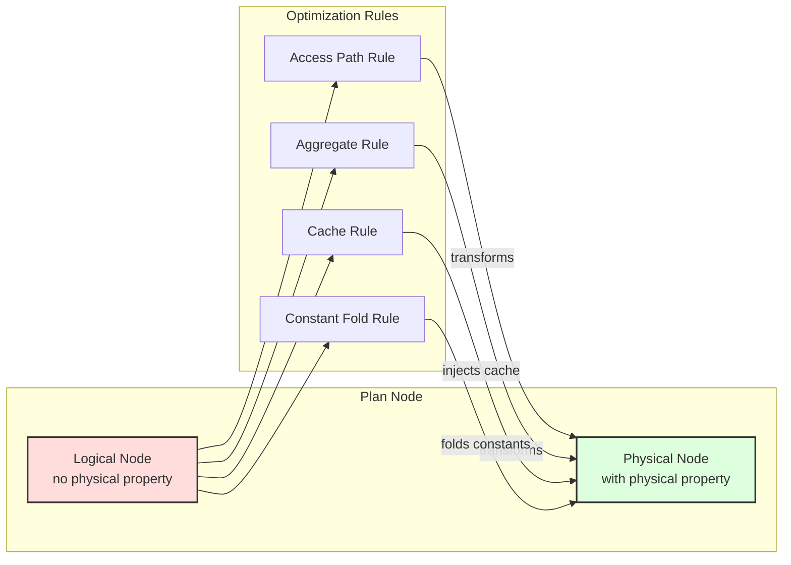

# Quereus Query Optimizer

The Quereus optimizer transforms logical query plans into efficient physical execution plans through a rule-based transformation system. This document provides a comprehensive reference for understanding and extending the optimizer.

## Philosophy

The Titan optimizer embodies several core principles that guide its design and implementation:

### Virtual Table Centric
The optimizer is built around the premise that all data access happens through virtual tables. This means optimization decisions must respect the capabilities and constraints exposed by each virtual table module through the `BestAccessPlan` API.

### Streaming First
Quereus prioritizes streaming execution over materialization. The optimizer favors transformations that preserve pipeline-able operations and only introduces blocking operations (sorts, materializations) when absolutely necessary for correctness or significant performance gains.

### Attribute-Based Identity
Column identity is tracked through stable attribute IDs rather than names or positions. This enables robust column reference resolution across arbitrary plan transformations without the fragility of name-based or position-based systems.

### Single Hierarchy, Dual Phase
Rather than maintaining separate logical and physical plan hierarchies, Quereus uses a single `PlanNode` tree that transitions from logical to physical through property annotation. This eliminates duplication while maintaining clear phase separation.

### Cost-Based with Heuristic Fallbacks
While the optimizer uses cost estimates to guide decisions, it provides sensible heuristic defaults when statistics are unavailable. This ensures reasonable plan quality even without detailed table statistics.

### Property based rules
Rather than tying rules to specific node types, as much as possible, the optimizer and its rules are tied to properties of the nodes, such as the physical properties, or the node's data type.  This reduces direct dependencies, making the system more robust and flexible.

## Architecture Overview

The Quereus optimizer operates as a transformation engine between the plan builder and runtime emitter:

```
┌─────────────┐     ┌──────────────┐     ┌─────────────┐     ┌──────────────┐
│   Parser    │ --> │   Builder    │ --> │  Optimizer  │ --> │   Emitter    │
│             │     │              │     │             │     │              │
│ SQL → AST   │     │ AST → Logic  │     │Logic → Phys │     │ Phys → Code  │
└─────────────┘     └──────────────┘     └─────────────┘     └──────────────┘
```

The optimization process transforms logical nodes into physical nodes through registered rules:



### Core Components

**Rule Engine** (`src/planner/optimizer.ts`)
- Manages rule registration and execution
- Orchestrates the logical-to-physical transformation
- Prevents infinite loops through visit tracking
- Provides debugging and tracing infrastructure

**Physical Properties** (`src/planner/framework/physical-utils.ts`)
- Captures execution characteristics: ordering, uniqueness, cardinality
- Propagates properties through plan transformations
- Enables property-based optimization decisions

**Rule Framework** (`src/planner/framework/`)
- Standard rule signature: `(node, context) → node | null`
- Context provides access to database, statistics, and tuning parameters
- Rules are pure functions that return transformed nodes or null

**Generic Tree Rewriting** (`PlanNode.withChildren()`)
- Every plan node implements generic tree reconstruction
- Preserves attribute IDs during transformations
- Eliminates manual node-specific handling in optimizer core

## Design Decisions

### Immutable Plan Nodes
Plan nodes are never mutated after construction. All transformations create new nodes, ensuring:
- Clear debugging with before/after comparisons
- Safe concurrent access during optimization
- Predictable transformation behavior

### Attribute ID Preservation
The optimizer guarantees that attribute IDs remain stable across transformations:
```typescript
// ProjectNode preserves original attribute IDs
const newProjections = this.projections.map((proj, i) => ({
  node: newProjectionNodes[i] as ScalarPlanNode,
  alias: proj.alias,
  attributeId: proj.attributeId // ✅ Preserved from original
}));
```

### Two-Phase Transformation
1. **Logical Phase**: Builder creates plan nodes without physical properties
2. **Physical Phase**: Optimizer transforms and annotates with physical properties

This separation allows the builder to focus on semantic correctness while the optimizer handles execution strategy.

### Rule-Based Transformation
Optimization logic is organized into focused, composable rules:
- Each rule has a single responsibility
- Rules can be enabled/disabled independently  
- New optimizations can be added without modifying core code
- Rules are registered per node type for efficient dispatch

## Engineering Considerations

### Generic Tree Walking
The optimizer uses a generic tree walking mechanism via `withChildren()`:

```typescript
private optimizeChildren(node: PlanNode): PlanNode {
  const originalChildren = node.getChildren();
  const optimizedChildren = originalChildren.map(child => this.optimizeNode(child));
  
  const childrenChanged = optimizedChildren.some((child, i) => child !== originalChildren[i]);
  if (!childrenChanged) {
    return node;
  }
  
  return node.withChildren(optimizedChildren); // Attribute IDs preserved
}
```

This eliminates error-prone manual reconstruction and ensures consistent handling across all node types.

### Cost Model Integration
Cost estimation is centralized in `src/planner/cost/index.ts`:
- Consistent formulas across optimization rules
- Tunable parameters via `OptimizerTuning`
- Clear units (rows, cost units, bytes)

### Statistics Abstraction
The `StatsProvider` interface allows pluggable statistics sources:
```typescript
interface StatsProvider {
  tableRows(table: TableSchema): number | undefined;
  selectivity(table: TableSchema, pred: ScalarPlanNode): number | undefined;
}
```

### Physical Properties System

Physical properties are automatically computed and cached for each plan node using a bottom-up inheritance model:

**Default Properties**
```typescript
const DEFAULT_PHYSICAL: PhysicalProperties = {
  deterministic: true,    // Pure - same inputs produce same outputs
  readonly: true,         // No side effects
  idempotent: true,       // Safe to call multiple times
  constant: false,        // Not a constant value
};
```

**Inheritance Model**
```typescript
// Physical properties are lazily computed and cached
get physical(): PhysicalProperties {
  if (!this._physical) {
    const childrenPhysical = this.getChildren().map(child => child.physical);

    // Get node-specific overrides
    const propsOverride = this.computePhysical?.(childrenPhysical);

    // Derive defaults from children if any, else use DEFAULT_PHYSICAL
    const defaults = childrenPhysical.length
      ? {
        deterministic: childrenPhysical.every(child => child.deterministic),
        idempotent: childrenPhysical.every(child => child.idempotent),
        readonly: childrenPhysical.every(child => child.readonly),
        constant: childrenPhysical.every(child => child.constant),
      }
      : DEFAULT_PHYSICAL;

    this._physical = { ...defaults, ...propsOverride };
  }
  return this._physical;
}
```

**Key Principles:**
- Leaf nodes get `DEFAULT_PHYSICAL` properties
- Parent nodes inherit the most restrictive properties from children
- Nodes can override specific properties via `computePhysical()`
- Properties are computed once and cached

**Property Computation Example**
```typescript
// SortNode only overrides specific properties
computePhysical(): Partial<PhysicalProperties> {
  return {
    ordering: extractOrderingFromSortKeys(this.sortKeys),
    estimatedRows: this.source.physical.estimatedRows,
    // deterministic and readonly are inherited from source
  };
}
```

### Constant Folding Subsystem

Constant folding is an elaborate optimization that evaluates constant expressions at plan time rather than runtime. The system uses a three-phase algorithm with sophisticated dependency tracking.

**Core Concepts**

The `constant` physical property has strict requirements:
- A node is `constant: true` **only if** it implements the `ConstantNode` interface with `getValue()`
- This means the node can statically provide its value at plan time
- Examples: `LiteralNode`, materialized relation nodes

```typescript
interface ConstantNode extends PlanNode {
  getValue(): OutputValue;  // Must return the constant value
}
```

**Three-Phase Algorithm**

Rather than stopping propagation when a column reference is found, the optimizer notes the reference and continues to see if the expressions remains otherwise constant at the point where said column is resolved.  This allows even complex queries to be fully folded, if they truly are constant.

1. **Bottom-up Classification**: Assigns `ConstInfo` to every node
   - `const`: Nodes with `physical.constant === true` that implement `getValue()`
   - `dep`: Nodes depending on specific attribute IDs (e.g., column references)
   - `non-const`: Non-functional nodes or those with non-const children

2. **Top-down Border Detection**: Identifies foldable nodes
   - Const nodes are always border nodes
   - Dep nodes become border nodes when their dependencies are resolved
   - Tracks which attributes are known constants in each scope

3. **Replacement Phase**: Replaces border nodes with literals
   - Scalar expressions → `LiteralNode`
   - Relational expressions → Materialized relation nodes (future)

**Dependency Resolution**

The system tracks constant attribute propagation through the plan:
```typescript
// ProjectNode produces constant attribute 42 if its expression is const
if (exprInfo?.kind === 'const') {
  updatedKnownAttrs.add(42);  // Attribute 42 is now a known constant
}

// Later, ColumnReference to attribute 42 can be folded
if (nodeInfo?.kind === 'dep' && isSubsetOf(nodeInfo.deps, knownConstAttrs)) {
  // This dep node can be folded because its dependencies are resolved
}
```

**Important Constraints**

- **Never set `constant: true` without implementing `getValue()`** - This will cause runtime errors
- **Constant folding respects functional properties** - Only nodes with `deterministic && readonly` are considered
- **The optimizer uses runtime evaluation** - Complex expressions are evaluated using the actual runtime, ensuring correctness

**Example: Constant Propagation**
```sql
-- Original query
SELECT x + 1 AS y FROM t WHERE y > 5;

-- After constant folding with known x = 10
SELECT 11 AS y FROM t WHERE 11 > 5;  -- Expression folded
SELECT 11 AS y FROM t WHERE true;    -- Predicate folded
```

## Component Reference

### Plan Node Hierarchy

All plan nodes extend the base `PlanNode` class and implement category-specific interfaces:

**Base Classes**
- `PlanNode`: Abstract base with cost, scope, and transformation methods
- `RelationalNode`: Nodes producing row streams (implement `getAttributes()`)
- `ScalarNode`: Nodes producing scalar values
- `VoidNode`: Nodes with side effects (DDL, DML)

**Key Methods**
- `getChildren()`: Returns all child nodes in consistent order
- `withChildren(newChildren)`: Creates new instance with updated children
- `computePhysical()`: Optionally overrides specific physical properties
- `getLogicalProperties()`: Returns logical plan information

### Optimization Rules

Rules are organized by optimization family in `src/planner/rules/`:

**Access Path Selection** (`access/`)
- `ruleSelectAccessPath`: Chooses between sequential scan, index scan, and index seek

**Aggregation** (`aggregate/`)
- `ruleAggregateStreaming`: Converts `AggregateNode` to `StreamAggregateNode` when beneficial

**Caching** (`cache/`)
- `ruleCteOptimization`: Adds caching to frequently-accessed CTEs
- `ruleMaterializationAdvisory`: Global analysis for cache injection
- `ruleMutatingSubqueryCache`: Ensures mutating subqueries execute once

**Constant Folding** (`rewrite/`)
- `ruleConstantFolding`: Evaluates constant expressions at plan time

### Virtual Table Integration

The optimizer integrates with virtual tables through the `BestAccessPlan` API:

```typescript
interface BestAccessPlanRequest {
  columns: readonly ColumnMeta[];
  filters: readonly PredicateConstraint[];
  requiredOrdering?: OrderingSpec;
  limit?: number | null;
  estimatedRows?: number;
}

interface BestAccessPlanResult {
  handledFilters: boolean[];
  cost: number;
  rows: number | undefined;
  providesOrdering?: OrderingSpec;
  uniqueRows?: boolean;
}
```

Virtual tables communicate their capabilities, allowing the optimizer to:
- Push predicates to the data source
- Utilize indexes for efficient access
- Preserve beneficial orderings
- Estimate result cardinalities

### Debugging and Tracing

The optimizer provides comprehensive debugging support:

**Debug Namespaces**
- `quereus:optimizer`: General optimizer operations
- `quereus:optimizer:rule:*`: Individual rule execution
- `quereus:optimizer:properties`: Physical property computation

**Trace Hooks**
```typescript
interface TraceHook {
  onRuleStart?(rule: RuleHandle, node: PlanNode): void;
  onRuleEnd?(rule: RuleHandle, before: PlanNode, after: PlanNode | undefined): void;
}
```

**Plan Visualization**
The PlanViz tool (`packages/tools/planviz`) provides visual plan inspection:
```bash
quereus-planviz query.sql --format tree
quereus-planviz query.sql --format mermaid --phase physical
```

## Extending the Optimizer

### Adding a New Optimization Rule

1. **Create Rule File** in appropriate subdirectory:
```typescript
// src/planner/rules/category/rule-name.ts
export function ruleMyOptimization(
  node: PlanNode,
  context: OptimizerContext
): PlanNode | null {
  // Check applicability
  if (!isApplicable(node)) {
    return null;
  }
  
  // Transform node
  const transformed = performTransformation(node);
  
  // Preserve attribute IDs!
  return transformed;
}
```

2. **Register Rule** in optimizer:
```typescript
// src/planner/optimizer.ts
this.registerRule('MyRule', PlanNodeType.Target, ruleMyOptimization);
```

3. **Add Tests** with golden plans:
```sql
-- test/plan/my-optimization/test.sql
SELECT * FROM users WHERE active = true;
```

### Best Practices

**Rule Development**
- Keep rules focused on a single transformation
- Return `null` for non-applicable cases
- Never mutate input nodes
- Always preserve attribute IDs
- Include comprehensive tests

**Property Computation**
- Implement `computePhysical()` to override physical properties for new node types
- Use automatic inheritance of properties from children when appropriate
- Document any property assumptions

**Cost Estimation**
- Use centralized cost functions
- Provide reasonable defaults
- Document cost model assumptions

## Common Patterns

### Predicate Analysis
```typescript
import { extractConstraints } from '../analysis/constraint-extractor.js';

const constraints = extractConstraints(predicate, tableColumns);
// Use constraints for index selection, pushdown, etc.
```

### Property Propagation
```typescript
computePhysical(): Partial<PhysicalProperties> {
  return {
    estimatedRows: this.source.estimatedRows,
    uniqueKeys: this.source.getType().keys.map(key => key.map(colRef => colRef.index)),
    ordering: this.providesOrdering
  };
}
```

### Cache Injection
```typescript
if (shouldCache(node, context)) {
  return new CacheNode(
    node.scope,
    node,
    'memory',
    calculateThreshold(node.physical.estimatedRows)
  );
}
```

## Performance Considerations

### Rule Ordering
- Rules execute in registration order
- Place cheap checks before expensive transformations
- Consider rule dependencies when ordering

### Property Caching
- Physical properties are computed once and cached
- Avoid redundant property calculations
- Use lazy evaluation where appropriate

### Memory Usage
- Plan trees can be large for complex queries
- Avoid keeping references to old plan nodes
- Clean up temporary data structures

## Future Directions

The optimizer architecture is designed to support future enhancements:

**Advanced Statistics**
- Histogram-based selectivity estimation
- Multi-column statistics
- Adaptive query optimization

**Additional Physical Operators**
- Hash joins and merge joins
- Parallel execution nodes
- Specialized aggregation algorithms

**Query Rewriting**
- Subquery decorrelation
- View expansion optimizations
- Common subexpression elimination
- Key driven row-count reduction

The modular rule-based design ensures these enhancements can be added incrementally without disrupting existing functionality. 

## Join Optimization with QuickPick

### Overview

Quereus will adopt the **QuickPick** algorithm (Neumann & Kemper, VLDB 2020) for join order optimization. This approach treats join ordering as a Traveling Salesman Problem (TSP) and uses random greedy tours to find near-optimal plans with minimal complexity.

### Why QuickPick?

**Simplicity**: ~200 lines of TypeScript vs thousands for traditional optimizers
- No complex memo structures or dynamic programming tables
- No equivalence classes or group management
- Just a tour generator and a min-heap of best plans

**Performance**: Achieves >95% of optimal plan quality with <1% of the time
- Scales linearly with number of joins × number of tours
- Naturally parallelizable (each tour is independent)
- Works well with approximate or missing statistics

**Perfect fit for Quereus**:
- Aligns with the project's lean, readable codebase philosophy
- Handles virtual tables with unknown cardinalities gracefully
- Integrates easily with async architecture
- Provides tunable quality/time tradeoff via `maxTours` parameter

### Algorithm Design

```typescript
interface JoinTour {
  relations: Set<RelationId>;
  currentPlan: RelationalPlanNode;
  totalCost: number;
}

class QuickPickOptimizer {
  async optimizeJoins(
    relations: RelationalPlanNode[],
    predicates: JoinPredicate[],
    options: { maxTours: number }
  ): Promise<RelationalPlanNode> {
    const bestPlans: RelationalPlanNode[] = [];
    
    for (let i = 0; i < options.maxTours; i++) {
      const tour = await this.runGreedyTour(relations, predicates);
      bestPlans.push(tour);
    }
    
    return this.selectBestPlan(bestPlans);
  }
  
  private async runGreedyTour(
    relations: RelationalPlanNode[],
    predicates: JoinPredicate[]
  ): Promise<RelationalPlanNode> {
    // Start with random relation
    const shuffled = [...relations].sort(() => Math.random() - 0.5);
    let current = shuffled[0];
    const remaining = new Set(shuffled.slice(1));
    
    while (remaining.size > 0) {
      // Find cheapest next join using surrogate cost
      const next = this.findCheapestJoin(current, remaining, predicates);
      current = this.createJoinNode(current, next.relation, next.predicate);
      remaining.delete(next.relation);
    }
    
    return current;
  }
}
```

### Integration Points

1. **Multi-pass optimizer framework**: QuickPick requires multiple optimization passes (one per tour)
2. **Cost model enhancement**: Need efficient join cardinality estimation
3. **Rule registration**: QuickPick will be a special "join enumeration" rule
4. **Tuning parameters**: Expose `maxTours` and early-stop thresholds

## Visited Tracking Architecture

### Design Philosophy

Quereus uses context-scoped visited tracking to handle optimization of directed acyclic graphs (DAGs) containing shared subtrees. This approach eliminates the architectural problems inherent in global tracking systems while enabling sophisticated multi-pass optimizations.

### Core Architecture

The visited tracking system is built around the optimization context rather than global state:

```typescript
interface OptContext {
  optimizer: Optimizer;
  stats: StatsProvider;
  tuning: OptimizerTuning;
  db: Database;
  
  // Context-scoped tracking
  visitedRules: Map<string, Set<string>>;     // nodeId → ruleIds applied in this context
  optimizedNodes: Map<string, PlanNode>;      // nodeId → optimized result cache
}
```

### Shared Subtree Handling

**Problem**: Traditional optimizers assume tree structures, but SQL plans form DAGs due to:
- CTEs referenced multiple times (`WITH t AS (...) SELECT * FROM t UNION SELECT * FROM t`)
- Correlated subqueries with repeated correlation variables
- View expansions that reference the same underlying tables

**Solution**: Context-scoped tracking treats each traversal path as independent:

```typescript
// Optimizer core handles shared nodes elegantly
optimizeNode(node: PlanNode, context: OptContext): PlanNode {
  // Check if we've already optimized this exact node instance
  const cached = context.optimizedNodes.get(node.id);
  if (cached) {
    return cached; // Reuse optimized version
  }
  
  // ... optimization logic ...
  
  // Cache result for future references in this context
  context.optimizedNodes.set(node.id, result);
  return result;
}
```

### Rule Application Control

Rules are prevented from infinite loops through per-context tracking:

```typescript
// Registry checks context-local visited state
hasRuleBeenApplied(nodeId: string, ruleId: string, context: OptContext): boolean {
  const nodeVisited = context.visitedRules.get(nodeId);
  return nodeVisited?.has(ruleId) ?? false;
}

// Marks are context-local, allowing same rule on shared nodes in different paths
markRuleApplied(nodeId: string, ruleId: string, context: OptContext): void {
  if (!context.visitedRules.has(nodeId)) {
    context.visitedRules.set(nodeId, new Set());
  }
  context.visitedRules.get(nodeId)!.add(ruleId);
}
```

### Multi-Pass Optimization Support

The architecture naturally supports multi-pass optimization strategies:

**Single-Pass (Current)**:
- One context per optimization session
- Rules fire once per node per context
- Shared nodes are cached and reused

**Multi-Pass (Future)**:
- Fresh context per optimization pass
- Different rule sets or heuristics per pass
- Best plan selection across all passes

### Context Lifecycle

Contexts can be derived and specialized for different optimization scenarios:

```typescript
class OptimizationContext {
  // Create context for different optimization phase
  withPhase(phase: 'rewrite' | 'impl'): OptimizationContext {
    const newContext = new OptimizationContext(/* ... */);
    this.copyTrackingState(newContext); // Preserve learned optimizations
    return newContext;
  }
  
  // Contexts can be forked for parallel exploration
  withIncrementedDepth(): OptimizationContext {
    // Inherits tracking state but can diverge independently
  }
}
```

### Performance Characteristics

**Memory**: O(nodes × rules) per context, garbage collected when context ends
**Time**: O(1) lookup for visited rules and optimized nodes
**Scalability**: Each context is independent, enabling parallel optimization

### Integration with Advanced Optimizations

The context-scoped design enables sophisticated optimization strategies:

**QuickPick Join Enumeration**:
- Each tour gets fresh context
- Same join nodes can be optimized differently in each tour
- Best plan selected across all contexts

**Adaptive Optimization**:
- Contexts can carry different statistics or cost models
- A/B testing of optimization strategies
- Runtime feedback integration

### Key-driven row-count reduction

* If a predicate contains **equality** on all columns of a unique key the result cardinality ≤ 1.

TODO

1. Extend `ConstraintExtractionResult` to carry `coveredKey` information.  
2. In `SeqScan/IndexSeek`, if `coveredKey` matches a unique key set `estimatedRows = 1` and, when every key column is constrained, propagate `derivedUniqueKeys = [[]]` (empty array means at most one row).

### Key inference after projections / joins

* Write helper `projectKeys(keys, columnMapping)` to push keys through `ProjectNode` / `ReturningNode`.  
* Write helper `combineJoinKeys(leftKeys, rightKeys, joinType)` (draft already lives in utils – wire it in).

