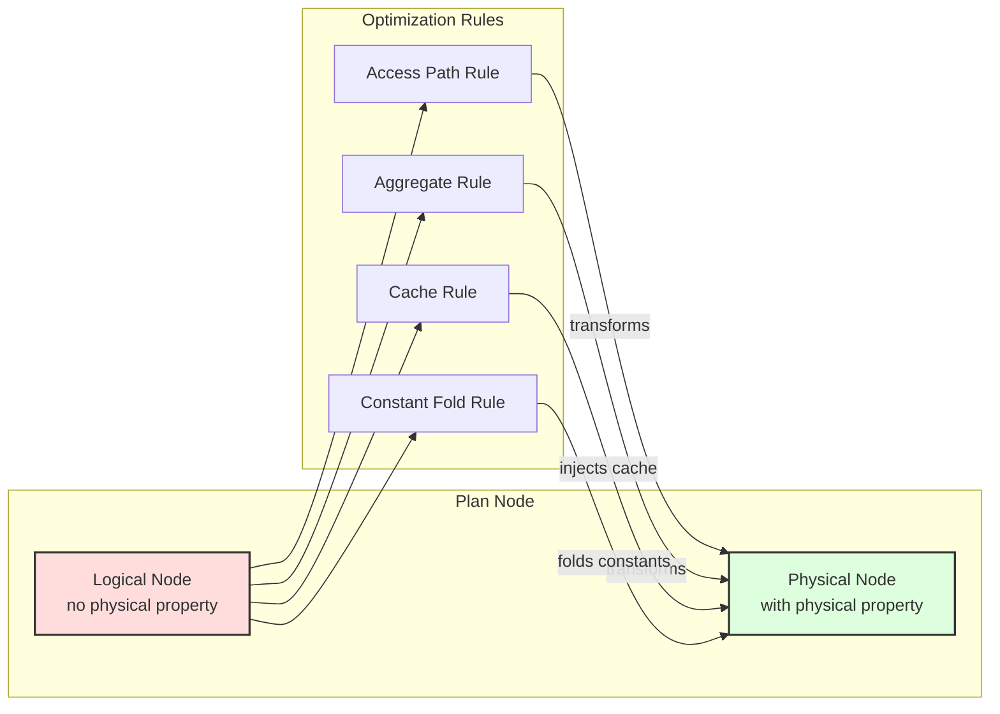

# Quereus Query Optimizer

The Quereus optimizer transforms logical query plans into efficient physical execution plans through a rule-based transformation system. This document provides a comprehensive reference for understanding and extending the optimizer.  This document reflects the current or future design of the system.  See TODO.md for descriptions of enhancements.

## Philosophy

The Titan optimizer embodies several core principles that guide its design and implementation:

### Virtual Table Centric
The optimizer is built around the premise that all data access happens through virtual tables. This means optimization decisions must respect the capabilities and constraints exposed by each virtual table module through the `BestAccessPlan` API.

### Streaming First
Quereus prioritizes streaming execution over materialization. The optimizer favors transformations that preserve pipeline-able operations and only introduces blocking operations (sorts, materializations) when absolutely necessary for correctness or significant performance gains.

### Attribute-Based Identity
Column identity is tracked through stable attribute IDs rather than names or positions. This enables robust column reference resolution across arbitrary plan transformations without the fragility of name-based or position-based systems.

### Single Hierarchy, Dual Phase
Rather than maintaining separate logical and physical plan hierarchies, Quereus uses a single `PlanNode` tree that transitions from logical to physical through property annotation. This eliminates duplication while maintaining clear phase separation.

### Cost-Based with Heuristic Fallbacks
While the optimizer uses cost estimates to guide decisions, it provides sensible heuristic defaults when statistics are unavailable. This ensures reasonable plan quality even without detailed table statistics.

### Property based rules
Rather than tying rules to specific node types, as much as possible, the optimizer and its rules are tied to properties of the nodes, such as the physical properties, or the node's data type.  This reduces direct dependencies, making the system more robust and flexible.

## Architecture Overview

The Quereus optimizer operates as a transformation engine between the plan builder and runtime emitter:

```
┌─────────────┐     ┌──────────────┐     ┌─────────────┐     ┌──────────────┐
│   Parser    │ --> │   Builder    │ --> │  Optimizer  │ --> │   Emitter    │
│             │     │              │     │             │     │              │
│ SQL → AST   │     │ AST → Logic  │     │Logic → Phys │     │ Phys → Code  │
└─────────────┘     └──────────────┘     └─────────────┘     └──────────────┘
```

The optimizer uses a **multi-pass architecture** where different categories of transformations occur in separate tree traversals. Each pass can use either top-down or bottom-up traversal order depending on its requirements:



### Multi-Pass Optimization System

The optimizer executes transformations through a series of **optimization passes**, each with a specific purpose and traversal order:

#### Pass 0: Constant Folding (Bottom-up)
- **Purpose**: Pre-evaluate constant expressions before other optimizations
- **Traversal**: Bottom-up to evaluate from leaves to root
- **Implementation**: Custom execution using runtime expression evaluator
- **Result**: Simplified plan with literals replacing constant expressions

#### Pass 1: Structural Transformations (Top-down)
- **Purpose**: Restructure the plan tree for optimal execution boundaries
- **Key Rules**: `ruleGrowRetrieve`, `rulePredicatePushdown`
- **Traversal**: Top-down to see parent context for sliding operations
- **Result**: Operations pushed into virtual table boundaries where beneficial

#### Pass 2: Physical Selection (Bottom-up)
- **Purpose**: Convert logical operators to physical implementations
- **Key Rules**: `ruleSelectAccessPath`, `ruleAggregateStreaming`
- **Traversal**: Bottom-up to select implementations based on child properties
- **Result**: Executable physical plan with concrete operators

#### Pass 3: Post-Optimization (Bottom-up)
- **Purpose**: Final cleanup, materialization decisions, and caching
- **Key Rules**: `ruleMaterializationAdvisory`, `ruleCteOptimization`, `ruleMutatingSubqueryCache`
- **Traversal**: Bottom-up for global analysis and cache injection
- **Result**: Optimized plan with caching and materialization points

#### Pass 4: Validation (Bottom-up)
- **Purpose**: Validate the correctness of the optimized plan
- **Implementation**: Structural and property validation checks
- **Result**: Verified executable plan or error if invalid

### Pass Framework (`src/planner/framework/pass.ts`)

The pass system provides a clean abstraction for multi-pass optimization:

```typescript
interface OptimizationPass {
  id: string;                          // Unique identifier
  name: string;                        // Human-readable name
  traversalOrder: TraversalOrder;      // 'top-down' or 'bottom-up'
  rules: RuleHandle[];                 // Rules belonging to this pass
  execute?: (plan, context) => plan;   // Optional custom execution
  order: number;                       // Execution order (lower first)
}
```

**Key Benefits**:
- **Separation of Concerns**: Each pass focuses on a specific optimization category
- **Proper Sequencing**: Structural transformations happen before physical selection
- **Flexible Traversal**: Each pass can choose its optimal traversal order
- **Clean Debugging**: Clear pass boundaries make optimization easier to understand

### Core Components

**Pass Manager** (`src/planner/framework/pass.ts`)
- Coordinates execution of all optimization passes
- Manages rule registration per pass
- Implements both top-down and bottom-up traversal strategies
- Provides hooks for custom pass execution logic

**Rule Engine** (`src/planner/optimizer.ts`)
- Registers rules to appropriate passes based on their purpose
- Creates optimization context for rule execution
- Integrates with pass manager for multi-pass optimization
- Provides debugging and tracing infrastructure

**Physical Properties** (`src/planner/framework/physical-utils.ts`)
- Captures execution characteristics: ordering, uniqueness, cardinality
- Propagates properties through plan transformations
- Enables property-based optimization decisions

**Rule Framework** (`src/planner/framework/`)
- Standard rule signature: `(node, context) → node | null`
- Context provides access to database, statistics, and tuning parameters
- Rules are pure functions that return transformed nodes or null

**Generic Tree Rewriting** (`PlanNode.withChildren()`)
- Every plan node implements generic tree reconstruction
- Preserves attribute IDs during transformations
- Eliminates manual node-specific handling in optimizer core

## Design Decisions

### Immutable Plan Nodes
Plan nodes are never mutated after construction. All transformations create new nodes, ensuring:
- Clear debugging with before/after comparisons
- Safe concurrent access during optimization
- Predictable transformation behavior

### Attribute ID Preservation
The optimizer guarantees that attribute IDs remain stable across transformations:
```typescript
// ProjectNode preserves original attribute IDs
const newProjections = this.projections.map((proj, i) => ({
  node: newProjectionNodes[i] as ScalarPlanNode,
  alias: proj.alias,
  attributeId: proj.attributeId // ✅ Preserved from original
}));
```

### Two-Phase Transformation
1. **Logical Phase**: Builder creates plan nodes without physical properties
2. **Physical Phase**: Optimizer transforms and annotates with physical properties

This separation allows the builder to focus on semantic correctness while the optimizer handles execution strategy.

### Rule-Based Transformation
Optimization logic is organized into focused, composable rules:
- Each rule has a single responsibility
- Rules can be enabled/disabled independently  
- New optimizations can be added without modifying core code
- Rules are registered per node type for efficient dispatch

## Engineering Considerations

### Generic Tree Walking
The optimizer uses a generic tree walking mechanism via `withChildren()`:

```typescript
private optimizeChildren(node: PlanNode): PlanNode {
  const originalChildren = node.getChildren();
  const optimizedChildren = originalChildren.map(child => this.optimizeNode(child));
  
  const childrenChanged = optimizedChildren.some((child, i) => child !== originalChildren[i]);
  if (!childrenChanged) {
    return node;
  }
  
  return node.withChildren(optimizedChildren); // Attribute IDs preserved
}
```

This eliminates error-prone manual reconstruction and ensures consistent handling across all node types.

### Cost Model Integration
Cost estimation is centralized in `src/planner/cost/index.ts`:
- Consistent formulas across optimization rules
- Tunable parameters via `OptimizerTuning`
- Clear units (rows, cost units, bytes)

### Statistics Abstraction
The `StatsProvider` interface allows pluggable statistics sources:
```typescript
interface StatsProvider {
  tableRows(table: TableSchema): number | undefined;
  selectivity(table: TableSchema, pred: ScalarPlanNode): number | undefined;
}
```

### Physical Properties System

Physical properties are automatically computed and cached for each plan node using a bottom-up inheritance model:

**Default Properties**
```typescript
const DEFAULT_PHYSICAL: PhysicalProperties = {
  deterministic: true,    // Pure - same inputs produce same outputs
  readonly: true,         // No side effects
  idempotent: true,       // Safe to call multiple times
  constant: false,        // Not a constant value
};
```

**Inheritance Model**
```typescript
// Physical properties are lazily computed and cached
get physical(): PhysicalProperties {
  if (!this._physical) {
    const childrenPhysical = this.getChildren().map(child => child.physical);

    // Get node-specific overrides
    const propsOverride = this.computePhysical?.(childrenPhysical);

    // Derive defaults from children if any, else use DEFAULT_PHYSICAL
    const defaults = childrenPhysical.length
      ? {
        deterministic: childrenPhysical.every(child => child.deterministic),
        idempotent: childrenPhysical.every(child => child.idempotent),
        readonly: childrenPhysical.every(child => child.readonly),
        constant: childrenPhysical.every(child => child.constant),
      }
      : DEFAULT_PHYSICAL;

    this._physical = { ...defaults, ...propsOverride };
  }
  return this._physical;
}
```

**Key Principles:**
- Leaf nodes get `DEFAULT_PHYSICAL` properties
- Parent nodes inherit the most restrictive properties from children
- Nodes can override specific properties via `computePhysical()`
- Properties are computed once and cached

**Property Computation Example**
```typescript
// SortNode only overrides specific properties
computePhysical(): Partial<PhysicalProperties> {
  return {
    ordering: extractOrderingFromSortKeys(this.sortKeys),
    estimatedRows: this.source.physical.estimatedRows,
    // deterministic and readonly are inherited from source
  };
}
```

### Constant Folding Subsystem

Constant folding is an elaborate optimization that evaluates constant expressions at plan time rather than runtime. The system uses a three-phase algorithm with sophisticated dependency tracking.

**Core Concepts**

The `constant` physical property has strict requirements:
- A node is `constant: true` **only if** it implements the `ConstantNode` interface with `getValue()`
- This means the node can statically provide its value at plan time
- Examples: `LiteralNode`, materialized relation nodes

```typescript
interface ConstantNode extends PlanNode {
  getValue(): OutputValue;  // Must return the constant value
}
```

**Three-Phase Algorithm**

Rather than stopping propagation when a column reference is found, the optimizer notes the reference and continues to see if the expressions remains otherwise constant at the point where said column is resolved.  This allows even complex queries to be fully folded, if they truly are constant.

1. **Bottom-up Classification**: Assigns `ConstInfo` to every node
   - `const`: Nodes with `physical.constant === true` that implement `getValue()`
   - `dep`: Nodes depending on specific attribute IDs (e.g., column references)
   - `non-const`: Non-functional nodes or those with non-const children

2. **Top-down Border Detection**: Identifies foldable nodes
   - Const nodes are always border nodes
   - Dep nodes become border nodes when their dependencies are resolved
   - Tracks which attributes are known constants in each scope

3. **Replacement Phase**: Replaces border nodes with literals
   - Scalar expressions → `LiteralNode`
   - Relational expressions → Materialized relation nodes (future)

**Dependency Resolution**

The system tracks constant attribute propagation through the plan:
```typescript
// ProjectNode produces constant attribute 42 if its expression is const
if (exprInfo?.kind === 'const') {
  updatedKnownAttrs.add(42);  // Attribute 42 is now a known constant
}

// Later, ColumnReference to attribute 42 can be folded
if (nodeInfo?.kind === 'dep' && isSubsetOf(nodeInfo.deps, knownConstAttrs)) {
  // This dep node can be folded because its dependencies are resolved
}
```

**Important Constraints**

- **Never set `constant: true` without implementing `getValue()`** - This will cause runtime errors
- **Constant folding respects functional properties** - Only nodes with `deterministic && readonly` are considered
- **The optimizer uses runtime evaluation** - Complex expressions are evaluated using the actual runtime, ensuring correctness

**Example: Constant Propagation**
```sql
-- Original query
SELECT x + 1 AS y FROM t WHERE y > 5;

-- After constant folding with known x = 10
SELECT 11 AS y FROM t WHERE 11 > 5;  -- Expression folded
SELECT 11 AS y FROM t WHERE true;    -- Predicate folded
```

## Component Reference

### Plan Node Hierarchy

All plan nodes extend the base `PlanNode` class and implement category-specific interfaces:

**Base Classes**
- `PlanNode`: Abstract base with cost, scope, and transformation methods
- `RelationalNode`: Nodes producing row streams (implement `getAttributes()`)
- `ScalarNode`: Nodes producing scalar values
- `VoidNode`: Nodes with side effects (DDL, DML)

**Key Methods**
- `getChildren()`: Returns all child nodes in consistent order
- `withChildren(newChildren)`: Creates new instance with updated children
- `computePhysical()`: Optionally overrides specific physical properties
- `getLogicalProperties()`: Returns logical plan information

### Optimization Rules

Rules are organized by optimization family in `src/planner/rules/`:

**Access Path Selection** (`access/`)
- `ruleSelectAccessPath`: Chooses between sequential scan, index scan, and index seek

**Aggregation** (`aggregate/`)
- `ruleAggregateStreaming`: Converts `AggregateNode` to `StreamAggregateNode` when beneficial

**Caching** (`cache/`)
- `ruleCteOptimization`: Adds caching to frequently-accessed CTEs
- `ruleMaterializationAdvisory`: Global analysis for cache injection
- `ruleMutatingSubqueryCache`: Ensures mutating subqueries execute once

**Constant Folding** (`rewrite/`)
- `ruleConstantFolding`: Evaluates constant expressions at plan time

### Virtual Table Integration

The optimizer integrates with virtual tables through the `BestAccessPlan` API:

```typescript
interface BestAccessPlanRequest {
  columns: readonly ColumnMeta[];
  filters: readonly PredicateConstraint[];
  requiredOrdering?: OrderingSpec;
  limit?: number | null;
  estimatedRows?: number;
}

interface BestAccessPlanResult {
  handledFilters: boolean[];
  cost: number;
  rows: number | undefined;
  providesOrdering?: OrderingSpec;
  uniqueRows?: boolean;
}
```

Virtual tables communicate their capabilities, allowing the optimizer to:
- Push predicates to the data source
- Utilize indexes for efficient access
- Preserve beneficial orderings
- Estimate result cardinalities

### Debugging and Tracing

The optimizer provides comprehensive debugging support:

**Debug Namespaces**
- `quereus:optimizer`: General optimizer operations
- `quereus:optimizer:rule:*`: Individual rule execution
- `quereus:optimizer:properties`: Physical property computation

**Trace Hooks**
```typescript
interface TraceHook {
  onRuleStart?(rule: RuleHandle, node: PlanNode): void;
  onRuleEnd?(rule: RuleHandle, before: PlanNode, after: PlanNode | undefined): void;
}
```

**Plan Visualization and Testing**
The PlanViz tool (`packages/tools/planviz`) provides visual plan inspection:
```bash
quereus-planviz query.sql --format tree
quereus-planviz query.sql --format mermaid --phase physical
```

Testing optimizer effects is easy using the `query_plan()` built-in:
```sql
-- Example: ensure FILTER was pushed into Retrieve (0 remaining above)
SELECT COUNT(*) AS filters
FROM query_plan('SELECT id FROM t WHERE id = 1')
WHERE op = 'FILTER';
```

## Extending the Optimizer

### Adding a New Optimization Rule

1. **Create Rule File** in appropriate subdirectory:
```typescript
// src/planner/rules/category/rule-name.ts
export function ruleMyOptimization(
  node: PlanNode,
  context: OptimizerContext
): PlanNode | null {
  // Check applicability
  if (!isApplicable(node)) {
    return null;
  }
  
  // Transform node
  const transformed = performTransformation(node);
  
  // Preserve attribute IDs!
  return transformed;
}
```

2. **Register Rule** in optimizer:
```typescript
// src/planner/optimizer.ts
this.registerRule('MyRule', PlanNodeType.Target, ruleMyOptimization);
```

3. **Add Tests** with golden plans:
```sql
-- test/plan/my-optimization/test.sql
SELECT * FROM users WHERE active = true;
```

### Best Practices

**Rule Development**
- Keep rules focused on a single transformation
- Return `null` for non-applicable cases
- Never mutate input nodes
- Always preserve attribute IDs
- **Use characteristics-based patterns**: Prefer `CapabilityDetectors` over `instanceof` checks for robust, extensible rules
- Include comprehensive tests

**Property Computation**
- Implement `computePhysical()` to override physical properties for new node types
- Use automatic inheritance of properties from children when appropriate
- Document any property assumptions

**Cost Estimation**
- Use centralized cost functions
- Provide reasonable defaults
- Document cost model assumptions

## Common Patterns

### Predicate Analysis and Pushdown

The optimizer includes sophisticated predicate analysis for pushdown optimization:

```typescript
import { extractConstraints, createTableInfoFromNode } from '../analysis/constraint-extractor.js';

// Extract constraints from filter predicates for pushdown
const tableInfo = createTableInfoFromNode(tableNode, 'main.users');
const result = extractConstraints(filterPredicate, [tableInfo]);

// Use constraints for virtual table pushdown
const tableConstraints = result.constraintsByTable.get('main.users');
if (tableConstraints) {
  // Push constraints to virtual table via BestAccessPlan API
  const pushedTable = new TableReferenceWithConstraintsNode(
    scope, tableSchema, vtabModule, tableConstraints
  );
}
```

**Predicate Pushdown Implementation:**
- **Normalization**: Pushes NOT, flattens AND/OR (no CNF/DNF), inverts comparisons; collapses small OR-of-equalities to `IN`; preserves BETWEEN (NOT BETWEEN remains residual).
- **Constraint Extraction**: Analyzes equality/range (`=`, `>`, `>=`, `<`, `<=`), `IS NULL`/`IS NOT NULL`, `BETWEEN` (as `>=`/`<=`), and `IN` value lists. Supports dynamic bindings: parameters and correlated references are captured alongside literal values.
- **Supported-only placement**: Only the portion of a predicate that is known to be supported by the target module/index is pushed into the `Retrieve` pipeline. Any residual (unsupported) part remains above the `Retrieve`. This guarantees the `Retrieve` pipeline exclusively contains supported operations.
- **Module Validation via supports()**: For query-based modules, a predicate (or entire filter node) is only pushed below the `RetrieveNode` when `supports()` accepts the resulting pipeline. Acceptance typically implies significantly lower cost and should be preferred over mere proximity to the data source.
- **Index-style Fallback**: When a module does not implement `supports()`, push-down uses `getBestAccessPlan()` for constraints translation; benefits may come from filter handling, ordering, and limit pushdown.
- **Filter Elimination**: Removes Filter nodes when all predicates are successfully handled by the module/index.
- **Multi-table Support**: Modules may accept complex subtrees (including joins) in a single `supports()` call when multiple relations belong to the same module.

### Property Propagation
```typescript
computePhysical(): Partial<PhysicalProperties> {
  return {
    estimatedRows: this.source.estimatedRows,
    uniqueKeys: this.source.getType().keys.map(key => key.map(colRef => colRef.index)),
    ordering: this.providesOrdering
  };
}
```

### Cache Injection
```typescript
if (shouldCache(node, context)) {
  return new CacheNode(
    node.scope,
    node,
    'memory',
    calculateThreshold(node.physical.estimatedRows)
  );
}
```

## Performance Considerations

### Rule Ordering
- Rules execute in registration order
- Place cheap checks before expensive transformations
- Consider rule dependencies when ordering

### Property Caching
- Physical properties are computed once and cached
- Avoid redundant property calculations
- Use lazy evaluation where appropriate

### Memory Usage
- Plan trees can be large for complex queries
- Avoid keeping references to old plan nodes
- Clean up temporary data structures

## Known Issues

**Current Limitations**
- **Enhanced Predicate Analysis**: The constraint extractor currently handles basic binary predicates but could be extended for OR conditions, IN lists, and complex expressions  
- **Suppressed Constant Folding**: Some constant folding optimizations are currently suppressed pending resolution of specific edge cases
- **Access Path Selection**: Phase 1.5 implementation exists but may require additional work for full production readiness

## Future Directions

The optimizer architecture is designed to support future enhancements:

**Advanced Statistics**
- Histogram-based selectivity estimation
- Multi-column statistics
- Adaptive query optimization

**Additional Physical Operators**
- Hash joins and merge joins
- Parallel execution nodes
- Specialized aggregation algorithms

**Query Rewriting**
- Subquery decorrelation
- View expansion optimizations
- Common subexpression elimination
- Key driven row-count reduction

The modular rule-based design ensures these enhancements can be added incrementally without disrupting existing functionality. 

## Join Optimization with QuickPick

### Overview

Quereus will adopt the **QuickPick** algorithm (Neumann & Kemper, VLDB 2020) for join order optimization. This approach treats join ordering as a Traveling Salesman Problem (TSP) and uses random greedy tours to find near-optimal plans with minimal complexity.

### Why QuickPick?

**Simplicity**: ~200 lines of TypeScript vs thousands for traditional optimizers
- No complex memo structures or dynamic programming tables
- No equivalence classes or group management
- Just a tour generator and a min-heap of best plans

**Performance**: Achieves >95% of optimal plan quality with <1% of the time
- Scales linearly with number of joins × number of tours
- Naturally parallelizable (each tour is independent)
- Works well with approximate or missing statistics

**Perfect fit for Quereus**:
- Aligns with the project's lean, readable codebase philosophy
- Handles virtual tables with unknown cardinalities gracefully
- Integrates easily with async architecture
- Provides tunable quality/time tradeoff via `maxTours` parameter

### Algorithm Design

```typescript
interface JoinTour {
  relations: Set<RelationId>;
  currentPlan: RelationalPlanNode;
  totalCost: number;
}

class QuickPickOptimizer {
  async optimizeJoins(
    relations: RelationalPlanNode[],
    predicates: JoinPredicate[],
    options: { maxTours: number }
  ): Promise<RelationalPlanNode> {
    const bestPlans: RelationalPlanNode[] = [];
    
    for (let i = 0; i < options.maxTours; i++) {
      const tour = await this.runGreedyTour(relations, predicates);
      bestPlans.push(tour);
    }
    
    return this.selectBestPlan(bestPlans);
  }
  
  private async runGreedyTour(
    relations: RelationalPlanNode[],
    predicates: JoinPredicate[]
  ): Promise<RelationalPlanNode> {
    // Start with random relation
    const shuffled = [...relations].sort(() => Math.random() - 0.5);
    let current = shuffled[0];
    const remaining = new Set(shuffled.slice(1));
    
    while (remaining.size > 0) {
      // Find cheapest next join using surrogate cost
      const next = this.findCheapestJoin(current, remaining, predicates);
      current = this.createJoinNode(current, next.relation, next.predicate);
      remaining.delete(next.relation);
    }
    
    return current;
  }
}
```

### Integration Points

1. **Multi-pass optimizer framework**: QuickPick requires multiple optimization passes (one per tour)
2. **Cost model enhancement**: Need efficient join cardinality estimation
3. **Rule registration**: QuickPick will be a special "join enumeration" rule
4. **Tuning parameters**: Expose `maxTours` and early-stop thresholds

## Visited Tracking Architecture

### Design Philosophy

Quereus uses context-scoped visited tracking to handle optimization of directed acyclic graphs (DAGs) containing shared subtrees. This approach eliminates the architectural problems inherent in global tracking systems while enabling sophisticated multi-pass optimizations.

### Core Architecture

The visited tracking system is built around the optimization context rather than global state:

```typescript
interface OptContext {
  optimizer: Optimizer;
  stats: StatsProvider;
  tuning: OptimizerTuning;
  db: Database;
  
  // Context-scoped tracking
  visitedRules: Map<string, Set<string>>;     // nodeId → ruleIds applied in this context
  optimizedNodes: Map<string, PlanNode>;      // nodeId → optimized result cache
}
```

### Shared Subtree Handling

**Problem**: Traditional optimizers assume tree structures, but SQL plans form DAGs due to:
- CTEs referenced multiple times (`WITH t AS (...) SELECT * FROM t UNION SELECT * FROM t`)
- Correlated subqueries with repeated correlation variables
- View expansions that reference the same underlying tables

**Solution**: Context-scoped tracking treats each traversal path as independent:

```typescript
// Optimizer core handles shared nodes elegantly
optimizeNode(node: PlanNode, context: OptContext): PlanNode {
  // Check if we've already optimized this exact node instance
  const cached = context.optimizedNodes.get(node.id);
  if (cached) {
    return cached; // Reuse optimized version
  }
  
  // ... optimization logic ...
  
  // Cache result for future references in this context
  context.optimizedNodes.set(node.id, result);
  return result;
}
```

### Rule Application Control

Rules are prevented from infinite loops through per-context tracking:

```typescript
// Registry checks context-local visited state
hasRuleBeenApplied(nodeId: string, ruleId: string, context: OptContext): boolean {
  const nodeVisited = context.visitedRules.get(nodeId);
  return nodeVisited?.has(ruleId) ?? false;
}

// Marks are context-local, allowing same rule on shared nodes in different paths
markRuleApplied(nodeId: string, ruleId: string, context: OptContext): void {
  if (!context.visitedRules.has(nodeId)) {
    context.visitedRules.set(nodeId, new Set());
  }
  context.visitedRules.get(nodeId)!.add(ruleId);
}
```

### Multi-Pass Optimization Support

The architecture naturally supports multi-pass optimization strategies:

**Single-Pass (Current)**:
- One context per optimization session
- Rules fire once per node per context
- Shared nodes are cached and reused

**Multi-Pass (Future)**:
- Fresh context per optimization pass
- Different rule sets or heuristics per pass
- Best plan selection across all passes

### Context Lifecycle

Contexts can be derived and specialized for different optimization scenarios:

```typescript
class OptimizationContext {
  // Create context for different optimization phase
  withPhase(phase: 'rewrite' | 'impl'): OptimizationContext {
    const newContext = new OptimizationContext(/* ... */);
    this.copyTrackingState(newContext); // Preserve learned optimizations
    return newContext;
  }
  
  // Contexts can be forked for parallel exploration
  withIncrementedDepth(): OptimizationContext {
    // Inherits tracking state but can diverge independently
  }
}
```

### Performance Characteristics

**Memory**: O(nodes × rules) per context, garbage collected when context ends
**Time**: O(1) lookup for visited rules and optimized nodes
**Scalability**: Each context is independent, enabling parallel optimization

### Integration with Advanced Optimizations

The context-scoped design enables sophisticated optimization strategies:

**QuickPick Join Enumeration**:
- Each tour gets fresh context
- Same join nodes can be optimized differently in each tour
- Best plan selected across all contexts

**Adaptive Optimization**:
- Contexts can carry different statistics or cost models
- A/B testing of optimization strategies
- Runtime feedback integration

### Key-driven row-count reduction

* If a predicate contains **equality** on all columns of a unique key the result cardinality ≤ 1.

TODO

1. Extend `ConstraintExtractionResult` to carry `coveredKey` information.  
2. In `SeqScan/IndexSeek`, if `coveredKey` matches a unique key set `estimatedRows = 1` and, when every key column is constrained, propagate `derivedUniqueKeys = [[]]` (empty array means at most one row).

### Key inference after projections / joins

* Write helper `projectKeys(keys, columnMapping)` to push keys through `ProjectNode` / `ReturningNode`.  
* Write helper `combineJoinKeys(leftKeys, rightKeys, joinType)` (draft already lives in utils – wire it in).

## Retrieve-based Push-down Architecture

### Overview

The Quereus optimizer features a comprehensive push-down infrastructure built around the `RetrieveNode` abstraction. This system enables virtual table modules to execute arbitrary query pipelines within their own execution context, providing a clean boundary between Quereus execution and module-specific optimization.

### RetrieveNode Infrastructure

**Core Concept**: Every `TableReferenceNode` is wrapped in a `RetrieveNode` at build time, marking the exact boundary where data transitions from virtual table module execution to Quereus execution.

```typescript
// Builder automatically wraps table references
export function buildTableReference(fromClause: AST.FromClause, context: PlanningContext): RetrieveNode {
  const tableRef = new TableReferenceNode(/* ... */);
  return new RetrieveNode(context.scope, tableRef, tableRef); // pipeline starts as just the table
}
```

**Structure**:
```
RetrieveNode
  └─ pipeline: RelationalPlanNode  (operations handled by the module)
      └─ TableReferenceNode        (leaf table reference)
  [bindings: ScalarPlanNode[]]     (captured params/correlated expressions)
```

### Supported-only placement policy

- **Pushdown rule**: When sliding a `Filter` down into a `Retrieve`, the optimizer:
  - Normalizes the predicate, extracts constraints for the `Retrieve` table, and constructs a supported-only predicate fragment.
  - Inserts only that fragment as a `Filter` inside the `Retrieve` pipeline.
  - Leaves any residual (unsupported) predicate above the `Retrieve` boundary.
  - Merges newly referenced bindings (parameters/correlations) into `Retrieve.bindings`.

- **Grow-retrieve rule**: When sliding `Retrieve` upward over a `Filter` (index-style fallback):
  - The rule mirrors the pushdown behavior: only supported fragments of the enveloped node are placed beneath `Retrieve` as a new `Filter`. The residual remains above.
  - Bindings are collected from the added fragment and merged into `Retrieve.bindings`.

This policy ensures the `Retrieve` pipeline is always a precise description of what the module/index can handle; unsupported parts never enter the boundary.

### Diagnostics and verification

- `query_plan(sql)` exposes `RETRIEVE` rows with logical properties including `bindingsCount` and `bindingsNodeTypes`, which reveal whether parameters and/or correlated column references have been captured by the pipeline.
- For test assertions, prefer checking for the presence of `ParameterReference` nodes in the plan (logical indicator of binding presence) rather than relying on `RETRIEVE` presence post-physical selection, since physical rules may replace `Retrieve` with concrete access operators.

### Module Capability API

**VirtualTableModule Interface**:
```typescript
interface VirtualTableModule {
  // Query-based push-down
  supports?(node: PlanNode): SupportAssessment | undefined;
  
  // Index-based access
  getBestAccessPlan?(req: BestAccessPlanRequest): BestAccessPlanResult;
}

interface SupportAssessment {
  cost: number;    // Module's cost estimate for executing this pipeline
  ctx?: unknown;   // Opaque context data cached for runtime execution
}
```

**VirtualTable Interface**:
```typescript
interface VirtualTable {
  // Runtime execution of pushed-down pipelines
  xExecutePlan?(db: Database, plan: PlanNode, ctx?: unknown): AsyncIterable<Row>;
  
  // Standard index-based query execution
  xQuery?(filterInfo: FilterInfo): AsyncIterable<Row>;
}
```

### Architecture Modes

**1. Query-based Push-down** (implements `supports()` + `xExecutePlan()`)
- Module analyzes entire query pipelines
- Returns cost assessment for execution within module
- Examples: SQL federation modules, document databases, remote APIs

**2. Index-based Access** (implements `getBestAccessPlan()` + `xQuery()`)
- Module exposes index capabilities
- Quereus pushes individual predicates via BestAccessPlan API
- Examples: MemoryTable, SQLite vtabs, file-based storage

**3. Hybrid Modules** (can implement both, but they're mutually exclusive per query)
- Modules can provide both interfaces
- Optimizer chooses based on cost assessment

### Access Path Selection

The `ruleSelectAccessPath` optimizer rule handles the routing decision:

```typescript
export function ruleSelectAccessPath(node: PlanNode, context: OptContext): PlanNode | null {
  if (!(node instanceof RetrieveNode)) return null;
  
  const vtabModule = node.vtabModule;
  
  // Query-based push-down takes priority
  if (vtabModule.supports) {
    const assessment = vtabModule.supports(node.source);
    if (assessment) {
      return new RemoteQueryNode(node.scope, node.source, node.tableRef, assessment.ctx);
    }
    // Module declined - fall back to sequential scan
    return createSeqScan(node.tableRef);
  }
  
  // Index-based access
  if (vtabModule.getBestAccessPlan) {
    return createIndexBasedAccess(node, context);
  }
  
  // Default sequential scan
  return createSeqScan(node.tableRef);
}
```

### Physical Execution Nodes

**RemoteQueryNode**:
- Represents execution of a pipeline within a virtual table module
- Calls `VirtualTable.xExecutePlan()` at runtime
- Passes the original plan pipeline and cached context

**Traditional Access Nodes**:
- `SeqScanNode`: Full table scan
- `IndexScanNode`: Index-based scan with filters
- `IndexSeekNode`: Index-based point/range lookups

### Parameterization hand-off

- For index-style providers, equality constraints that fully cover the primary key (and leading index prefixes) are translated into `IndexSeekNode` with dynamic seek keys:
  - Seek keys are stored as scalar expressions (parameters or correlated refs), evaluated at runtime by the emitter and passed to the module via the existing `FilterInfo.args` mechanism.
  - Range bounds (>=/<=) will similarly pass dynamic lower/upper expressions.

This establishes a clean “call-like” boundary: `Retrieve.bindings` declares required inputs; physical access nodes evaluate those inputs and deliver them to the module.

### Runtime Execution

**Query-based Execution**:
```typescript
// emitRemoteQuery.ts
export function emitRemoteQuery(plan: RemoteQueryNode, ctx: EmissionContext): Instruction {
  async function* run(rctx: RuntimeContext): AsyncIterable<Row> {
    const table = plan.vtabModule.xConnect(/* ... */);
    yield* table.xExecutePlan!(rctx.db, plan.source, plan.moduleCtx);
  }
  return { params: [], run, note: `remoteQuery(${plan.tableRef.tableSchema.name})` };
}
```

**Index-based Execution**:
- Uses existing `xQuery()` with `FilterInfo` parameter
- Leverages `BestAccessPlan` API for predicate push-down

### Integration Points

**Builder Integration**:
- All table references automatically wrapped in `RetrieveNode`
- DML operations (INSERT/UPDATE/DELETE) extract `tableRef` from `RetrieveNode`
- Maintains backward compatibility with existing code

**Optimizer Integration**:
- `ruleSelectAccessPath` registered for `PlanNodeType.Retrieve`
- Physical properties correctly propagated through `RemoteQueryNode`
- Cost estimation integrated with existing cost model

**Runtime Integration**:
- `RemoteQueryNode` emitter registered in runtime system
- Error handling for modules without `xExecutePlan()` implementation
- Seamless execution alongside traditional access methods

### Dynamic support growth with ruleGrowRetrieve

The `ruleGrowRetrieve` optimization rule enables dynamic sliding of operations into virtual table modules:

**Algorithm**: Structural top-down growth pass that:
1. Creates a candidate pipeline by grafting the parent operation onto the current pipeline
2. Calls `module.supports(candidatePipeline)` or index-style fallback (`getBestAccessPlan`) for assessment
3. If supported, replaces the parent with a new `RetrieveNode` containing the expanded pipeline
4. Continues sliding upward until the module declines or the tree top is reached

**Benefits**:
- Multi-pass architecture ensures structural growth happens before physical selection
- Cost-based decision making between local and remote execution
- Modules evaluate exactly the operations they commit to handle

This architecture establishes Quereus as a powerful federation engine while maintaining its lean, readable codebase philosophy and excellent virtual table integration.

## ApplyNode Architecture for Correlated Joins

### Design Philosophy

To enable lateral joins and sophisticated push-down optimization, Quereus uses an **ApplyNode** abstraction that replaces traditional `JoinNode` semantics. This design provides a unified framework for handling correlated operations while maintaining clean separation between logical and physical execution strategies.

### Core Concept

The `ApplyNode` represents a correlated operation where the right-side subtree is executed once per row from the left side, with correlation context passed through:

```typescript
interface ApplyNode {
  left: RelationalPlanNode;     // Drive relation
  right: RelationalPlanNode;    // Applied relation (may start with RetrieveNode)
  predicate: ScalarPlanNode | null;  // Join condition
  outer: boolean;               // LEFT JOIN semantics when true
}
```

### SQL Mapping

Traditional SQL join constructs map naturally to ApplyNode semantics:

| SQL Construct | ApplyNode Form |
|---------------|----------------|
| `A CROSS JOIN B` | `Apply(A, B, null, false)` |
| `A INNER JOIN B ON p` | `Apply(A, Filter(p, B), p, false)` |
| `A LEFT JOIN B ON p` | `Apply(A, Filter(p, B), p, true)` |

### Push-down Integration

The ApplyNode design enables sophisticated push-down optimization:

**Correlated Push-down**: When the right side contains a `RetrieveNode`, correlation values from the left side can be pushed into the virtual table module as additional constraints.

**Index Seek Optimization**: Virtual table modules can use correlation values to perform efficient index seeks rather than full scans.

**Pipeline Composition**: The right-side pipeline can be arbitrarily complex, allowing modules to optimize entire correlated subqueries.

### Execution Model

**Runtime Semantics**:
1. Iterate through each row from the left relation
2. Pass correlation context to the right relation's execution
3. Execute right relation with correlated values as additional constraints
4. Combine results according to join semantics (inner/outer)

**Virtual Table Integration**:
```typescript
// Right-side RetrieveNode receives correlation context
const correlatedConstraints = extractCorrelationConstraints(leftRow, rightPipeline);
const assessment = vtabModule.supports(rightPipeline, correlatedConstraints);
if (assessment) {
  // Module can optimize correlated access (e.g., index seek)
  yield* table.xExecutePlan(db, rightPipeline, { 
    ...assessment.ctx, 
    correlation: correlatedConstraints 
  });
}
```

### Performance Characteristics

**Nested Loop Foundation**: ApplyNode provides a clean nested-loop foundation that can be optimized based on virtual table capabilities.

**Adaptive Optimization**: Modules can choose between full scans and index seeks based on correlation selectivity.

**Later Physical Optimization**: Non-correlated Apply operations can be transformed into hash joins or merge joins by later optimization phases.

### Benefits

**Orthogonality**: Clean separation between correlation logic and push-down optimization.

**Extensibility**: Virtual table modules can implement sophisticated correlated access patterns.

**Simplicity**: Unified execution model eliminates special cases for different join types.

**Federation**: Enables complex correlated queries to be pushed to remote systems (e.g., SQL databases, document stores).

This design positions Quereus to handle complex analytical workloads while maintaining the flexibility to optimize across diverse data sources and virtual table implementations.

### ruleGrowRetrieve Design

The `ruleGrowRetrieve` optimizer rule implements a **structural, capability-bounded** sliding algorithm that maximizes the query segment each virtual table module can execute:

**Algorithm**:
1. **Top-down traversal (Structural pass)**: Walk the plan tree from root toward leaves so parents can be slid into their `RetrieveNode` children
2. **Capability testing**: For each candidate, test `supports(candidatePipeline)` where candidatePipeline = current pipeline + parent node; else use index-style fallback
3. **Slide on success**: If the module supports the expanded pipeline, slide the `RetrieveNode` upward to encompass the parent
4. **Stop on failure**: When `supports()` returns undefined, the `RetrieveNode` has reached its maximum extent

**Key Properties**:
- Purely structural - no cost modeling required during growth phase
- Deterministic - always finds the maximum supportable pipeline
- Module-bounded - respects exactly what each module declares it can handle
- Foundation for subsequent push-down - establishes the "query segment" baseline

```typescript
// Example: Filter above table reference
Filter(condition) 
  └── RetrieveNode(source: TableRef)

// After ruleGrowRetrieve (assuming module supports filtering):
RetrieveNode(source: Filter(condition, TableRef))
```

**Modules can accept arbitrary nodes**: `supports()` may accept complex subtrees, including joins across multiple tables that reside in the same module. When a module declares support for such a subtree, `ruleGrowRetrieve` will slide those operations into the `RetrieveNode` boundary, enabling efficient intra-module execution.

## Optimization Pipeline Architecture

Quereus uses a **characteristic-based** optimization pipeline that leverages the unique logical properties of different node types to apply rules in optimal sequence. The RetrieveNode's unique logical representation makes it an ideal boundary marker for this approach.

### Phase Sequencing Strategy

**0. Builder Output**
- Every `TableReferenceNode` automatically wrapped in `RetrieveNode`
- Establishes clear module execution boundaries from the start

**1. Grow-Retrieve (Structural Phase)**
- **Target**: `RetrieveNode` characteristics
- **Purpose**: Find maximum contiguous pipeline each module can execute
- **Method**: Bottom-up sliding based on `supports()` responses
- **Result**: Fixed, module-guaranteed "query segments" for every base relation

**2. Early Predicate Push-down (Cost-Light Phase)**  
- **Target**: Filter nodes with simple characteristics (constant predicates, key equality, etc.)
- **Purpose**: Improve cardinality estimates before expensive join enumeration
- **Method**: Push obviously beneficial predicates into established query segments
- **Constraint**: Only push predicates that modules explicitly support

**3. Join Enumeration & Rewriting (Cost-Heavy Phase)**
- **Target**: Join tree characteristics and cardinality estimates
- **Purpose**: Find optimal join order using realistic row estimates
- **Method**: Traditional dynamic programming with accurate base relation costs
- **Foundation**: Benefits from realistic cardinality estimates from phases 1-2

**4. Advanced Predicate Push-down (Cost-Precise Phase)**
- **Target**: Complex filter characteristics (OR-predicates, subquery filters, etc.)
- **Purpose**: Final optimization opportunities with complete cost model
- **Method**: Sophisticated cost-based decisions on predicate placement
- **Context**: Full join plan available for accurate cost assessment

### Characteristic-Based Rule Design Philosophy

**RetrieveNode Exception**: While Quereus generally avoids hard-coding specific node types in rules, `RetrieveNode` represents a unique logical concept - the module execution boundary. This makes it appropriate to have rules that specifically target `RetrieveNode` characteristics.

**General Principle**: Most other rules should operate on logical characteristics rather than specific node types:
- Filter placement based on selectivity characteristics
- Join reordering based on cardinality characteristics  
- Projection elimination based on attribute usage characteristics

**Benefits of This Approach**:
- Rules remain orthogonal and composable
- Easy to add new node types without breaking existing rules
- Clear separation of concerns between different optimization phases
- Predictable rule application order based on logical properties

