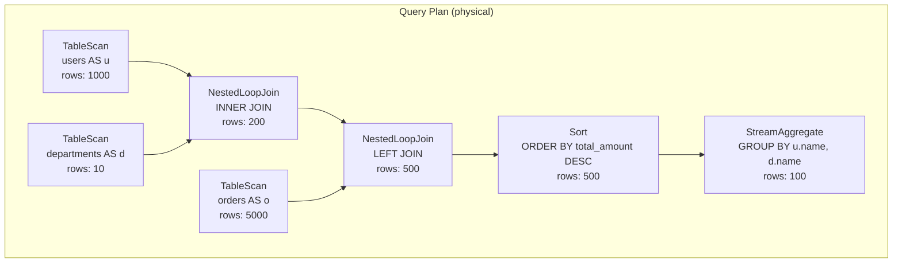

# Quereus PlanViz

Visual query plan inspection tool for Quereus SQL engine.

## Installation

```bash
yarn global add @quereus/planviz
```

## Usage

### Basic Usage

```bash
# Analyze a SQL file
quereus-planviz query.sql

# Read from stdin
echo "SELECT * FROM users WHERE age > 25" | quereus-planviz

# Save output to file
quereus-planviz query.sql -o plan.txt
```

### Output Formats

#### Tree Format (Default)
```bash
quereus-planviz query.sql --format tree
```
Displays a hierarchical tree view with cost and row estimates.

#### JSON Format
```bash
quereus-planviz query.sql --format json
```
Outputs the plan as structured JSON for programmatic analysis.

#### Mermaid Diagram
```bash
quereus-planviz query.sql --format mermaid
```
Generates a Mermaid diagram for visual representation.

### Plan Phases

#### Physical Plan (Default)
```bash
quereus-planviz query.sql --phase physical
```
Shows the optimized physical execution plan.

#### Logical Plan
```bash
quereus-planviz query.sql --phase logical
```
Shows the logical plan before optimization.

#### Instruction Program
```bash
quereus-planviz query.sql --phase emitted
```
Shows the low-level instruction program.

### Advanced Features

#### Browser Integration
```bash
quereus-planviz query.sql --format mermaid --open
```
Automatically opens the Mermaid diagram in your browser using Mermaid Live Editor.

#### Verbose Output
```bash
quereus-planviz query.sql --verbose
```
Shows detailed processing information.

## Examples

### Complex Query Analysis
```bash
# Analyze a complex query with joins and aggregations
quereus-planviz examples/test.sql --format tree --verbose

# Generate Mermaid diagram and open in browser
quereus-planviz examples/test.sql --format mermaid --open

# Save JSON plan for analysis
quereus-planviz examples/test.sql --format json -o plan.json
```

### Pipeline Integration
```bash
# Use in a pipeline
cat query.sql | quereus-planviz --format json | jq '.nodeType'
```

## Output Examples

### Tree Format
```
Query Plan (physical):

└── StreamAggregate GROUP BY u.name, d.name  AGG  COUNT(*) AS order_count, SUM(amount) AS total_amount (rows: 100)
    └── Sort ORDER BY total_amount DESC (rows: 500)
        └── NestedLoopJoin LEFT JOIN (rows: 500)
            ├── NestedLoopJoin INNER JOIN (rows: 200) 
            │   ├── TableScan users AS u (rows: 1000)
            │   └── TableScan departments AS d (rows: 10)
            └── TableScan orders AS o (rows: 5000)
```

### Mermaid Diagram


## Development

### Building
```bash
yarn build
```

### Testing
```bash
yarn test
```

## Schema Setup

PlanViz automatically sets up a test schema with the following tables:
- `users` (id, name, age, dept_id)
- `departments` (id, name, budget)  
- `orders` (id, user_id, amount, order_date)

This allows analysis of queries without requiring a pre-existing database.

## Integration with CI/CD

### Generate Plan Artifacts
```bash
# Generate plan visualizations for documentation
quereus-planviz test/queries/*.sql --format mermaid --output docs/plans/
```

### Automated Analysis
```bash
# Check for plan regressions
quereus-planviz query.sql --format json > current-plan.json
diff expected-plan.json current-plan.json
```

## API Usage

PlanViz can also be used programmatically:

```typescript
import { PlanVisualizer } from '@quereus/planviz';

const visualizer = new PlanVisualizer();
const treeOutput = visualizer.renderTree(plan, 'physical');
const mermaidDiagram = visualizer.renderMermaid(plan, 'physical');
``` 
